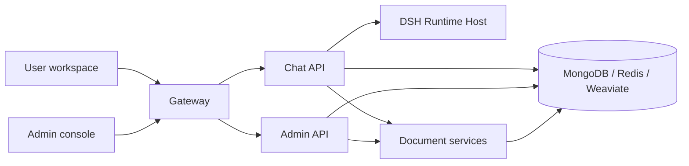

<p align="center">
  
</p>

<h1 align="center">MOVO Community Edition</h1>

<p align="center">
  A self-hosted enterprise Agent platform built on DeepSeek Harness (DSH).
</p>

<p align="center">
  <strong>English</strong> · <a href="README.zh-CN.md">简体中文</a>
</p>

<p align="center">
  <a href="#start-in-5-minutes"><strong>🚀 Quick Start</strong></a> ·
  <a href="https://movo.oss-cn-beijing.aliyuncs.com/5E22C353-55F1-45AB-B606-0ED16CC99833.mp4"><strong>▶ Watch Demo</strong></a> ·
  <a href="https://www.himovo.com/en/guide/introduction.html"><strong>📘 Documentation</strong></a> ·
  <a href="https://github.com/himovo/movo/releases/latest"><strong>🆕 What's New</strong></a>
</p>

<p align="center">
  <a href="https://github.com/himovo/movo"></a> · <a href="https://linux.do" alt="LINUX DO"></a><br>
  If MOVO is useful to you, click <strong>Star</strong> in the upper-right corner to support the project.
</p>

<br>

MOVO brings DSH Agents from development experiments into enterprise production. It combines the DSH Runtime, Skills, Tools and MCP ecosystem with a deployable user workspace, enterprise knowledge, identity and access control, administration, governance and file delivery.

> **In one sentence:** DSH runs the Agent; MOVO brings the Agent into enterprise production.

<br>

<p align="center">
  
</p>

<br>

This repository contains the self-hosted MOVO Community Edition.

## Start in 5 minutes

With Git and Docker Desktop (or Docker Engine with Docker Compose v2) installed:

```bash
git clone https://github.com/himovo/movo.git
cd movo
chmod +x movo
./movo up
```

Then open:

```text
http://localhost:3000/admin/setup
```

The launcher pulls the official prebuilt images, waits for the services to become healthy and prints the setup address. No `.env` file or local image build is required. Windows users should run MOVO inside an Ubuntu WSL 2 distribution; see the [Windows installation guide](docs/windows-installation.md).

> Got MOVO running? Please click **Star** in the upper-right corner. It helps more developers discover the project.

## Product demo

See MOVO in action in the complete product walkthrough:

<p align="center">
  <a href="https://movo.oss-cn-beijing.aliyuncs.com/5E22C353-55F1-45AB-B606-0ED16CC99833.mp4"><strong>▶ Watch the MOVO demo video</strong></a>
</p>

The video opens in your browser and can be played directly without downloading it first.

## Why MOVO

Running an Agent demo is very different from operating an Agent platform for a team. MOVO provides the product and infrastructure layer around DSH so you can move into real use without assembling authentication, knowledge, administration, governance and delivery systems yourself.

- **Stay native to DSH.** Use the official DSH Runtime, Skills, Tools, MCP integrations and sub-agent capabilities instead of adopting a disconnected proprietary runtime.
- **Deploy a complete product.** Start the user workspace, admin console, APIs, document processing, retrieval and infrastructure together with Docker Compose.
- **Keep control of models and data.** Connect your own model providers and keep application data, knowledge and runtime services in your deployment.
- **Serve users as well as developers.** Give employees a usable workspace while administrators manage accounts, models, knowledge, capabilities, quotas and audit records.
- **Grow without rebuilding the foundation.** Begin with the self-hosted Community Edition and retain the same shared source foundation as deployment requirements expand.

If you only need a low-level Agent runtime, DSH may be enough. Choose MOVO when you need to turn that runtime into a deployable, manageable product for real users.

## What MOVO provides

| Capability | What you can do |
| --- | --- |
| DSH-native Agent runtime | Use planning, tool calls, Skills, sub-agents and governed execution through the bundled DSH Runtime Host. |
| Enterprise knowledge and research | Search internal documents and public sources, run multi-round research, retain citations and inspect supporting evidence. |
| Document and multimodal intelligence | Parse PDF, DOCX, XLSX, PPTX, CSV and Markdown files, including images, charts and other visual content. |
| Content and file generation | Create reports, articles, PPTX presentation files, spreadsheets, PDFs and Markdown deliverables. |
| Skills, Tools and MCP | Reuse workflows and connect HTTP or MCP services to business systems. |
| Automation and governance | Schedule tasks, require approval for sensitive tool actions, trace executions and retain generated artifacts. |
| Enterprise administration | Manage organizations, users, roles, models, knowledge, Skills, Tools, audit records and runtime health. |

Typical use cases include enterprise knowledge Q&A, policy and project-material retrieval, multi-source research, competitive analysis, report and presentation generation, spreadsheet processing, translation, template filling and controlled system integration.

## Enterprise governance and reliability

Beyond the Agent runtime itself, MOVO ships the governance, reliability and collaboration layer that moving an Agent into production actually requires. The following capabilities are implemented, tested and available in this release:

### P0 — compliance entry ticket and production availability

| Capability | What it delivers |
| --- | --- |
| **Gatekeeper six-layer gate** | Identity → RBAC → redaction → approval → quota → audit as one serial chain. R4 red-line actions cannot be overridden by any layer. |
| **Risk grading and autonomy matrix** | R0–R4 tool risk tiers plus an L1–L5 × R0–R4 autonomy matrix (25 cells) that turns ad-hoc "approve the sensitive tool" prompts into systematic, graded delegation of authority. |
| **Fine-grained RBAC permission codes** | `<resource>:<action>[:<target>]` codes with three-level isolation and fail-closed behavior, replacing coarse job-role checks. |
| **PII redaction** | Private keys, national IDs, bank cards and phone numbers handled by `mask` / `remove` / `hash` / `abstract` policies — applied both at runtime and when a session is saved or shared, with reversible placeholders and read-only clones. |
| **LLM gateway resilience** | Primary → standby failover, a degradation chain that steps down through fallback models, exponential-backoff retry, and usage and cost metering. |
| **Operations dashboard** | A four-dimension cockpit in the admin console — cost (token totals, per-model share, department and agent attribution, forecasting), usage (call volume, active users, Skill and retrieval frequency), quality (success rate, latency, anomaly and manual-intervention rates) and trends (period-over-period deltas and bottleneck identification). |

### P1 — extensibility and session-level collaboration

| Capability | What it delivers |
| --- | --- |
| **Hooks interception** | Five lifecycle events (SessionStart, PreToolUse, PostToolUse, SessionEnd, MemoryCommit) with timeout protection, fail-closed semantics and declarative rules (`deny_tool` / `require_field` / `observe`). PreToolUse ships with a tool > session > tenant rule precedence and a ≤5 s latency budget, giving a low-cost extension point for compliance interception, field validation and tool denial. |
| **DAG orchestration engine** | Four modes (sequential, supervisor, hybrid, graph), topological sorting with cycle detection, conditional skipping with tri-state fail-closed evaluation and tracing, and node-level exponential-backoff retry. |
| **Session and workflow versioning** | Session `commit` builds a linear timeline, one-time `share` links (300 s TTL) hand over requirements, discussion and execution context, and co-presence lets several people work in the same session. Workflow definitions are versioned through the orchestration engine. |

Longer-horizon work — self-evolving Dream Cycle, A2A interop, multi-IM entry points, business-system semantic indexing, knowledge graph, Skill marketplace hardening, three-scope memory, capability asset registration and elastic Harness profiles — is planned for later stages. See [`docs/MOVO企业级智能体功能补强规划.md`](docs/MOVO企业级智能体功能补强规划.md) for the full roadmap and [`docs/SDD界面呈现对照表.md`](docs/SDD界面呈现对照表.md) for the mapping from that roadmap to specifications and UI entry points.

## Community Edition

A tenant created by the self-hosted setup flow is marked as `community`:

- no member-count limit;
- billing and commercial plan enforcement are disabled;
- self-managed model connections are enabled;
- data and runtime services remain in your own deployment.

The repository includes the Web user workspace, administration console, conversation and Agent APIs, DSH Runtime Host, document parser and retrieval services, and Docker deployment configuration.

### Browser Agent and Code Agent

The self-hosted Web workspace supports chat, research, knowledge, files and content generation. To use **Browser Agent** or **Code Agent**, install [MOVO Desktop](https://www.himovo.com/en/download.html) and connect it to your self-hosted MOVO service.

MOVO Desktop provides the local browser session, code workspace, project terminal and Git integration required by these capabilities. It is distributed separately as proprietary software; its source code is not included in this repository and is not part of the Community Edition source release.

| Capability | Self-hosted Web | MOVO Desktop |
| --- | :---: | :---: |
| Chat, research and enterprise knowledge | ✓ | ✓ |
| Document understanding and content generation | ✓ | ✓ |
| Browser Agent | — | ✓ |
| Code Agent, local projects, terminal and Git | — | ✓ |
| Requires a self-hosted MOVO service | ✓ | ✓, connects to that service |
| Source included in this repository | ✓ | —, distributed separately |

## Architecture



The default Docker Compose deployment starts 12 services: the gateway, two Web applications, three application APIs, the DSH Runtime Host, a document worker, MongoDB, Redis, Weaviate and a one-time secret bootstrap service.

## Deployment and operations

### Requirements and platform notes

- Git
- Docker Desktop, or Docker Engine with Docker Compose v2
- at least 8 GB of available memory
- at least 20 GB of available disk space for images and application data
- network access to GHCR and Docker Hub during the initial image pull
- credentials for at least one compatible model API to complete setup

The quick-start command above works on Linux and macOS. `./movo up` pulls the published MOVO and infrastructure images sequentially and keeps retrying network failures until the pull succeeds or the user presses `Ctrl+C`. The first startup downloads several container images and can take some time, especially when access to GHCR or Docker Hub is slow. Normal users do **not** need to build the images locally.

On Windows, use Docker Desktop with WSL 2 and Ubuntu. Check that Ubuntu exists with `wsl -l -v`, then enter it explicitly with `wsl -d Ubuntu`; do not run MOVO from a prompt beginning with `docker-desktop:`. See the complete [Windows installation guide](docs/windows-installation.md).

You can also start the same official prebuilt images directly with `docker compose up -d`, including from Windows PowerShell or Command Prompt. Neither command requires an `.env` file, but native Compose pulls in parallel and does not provide the launcher's continuous retry loop or readiness wait. To build and start local images from source instead, use `./movo up --build`.

Open:

```text
http://localhost:3000/admin/setup
```

The setup wizard checks the deployment and guides you through creating the organization and initial accounts, connecting a default chat model, and optionally configuring embedding, reranking, vision, image generation and Web search providers. Provider credentials are encrypted before storage.

After setup:

| Entry | Default URL | Purpose |
| --- | --- | --- |
| User workspace | `http://localhost:3000/` | Conversations, research, knowledge, files and content generation |
| Admin console | `http://localhost:3000/admin/` | Users, models, knowledge, Skills, Tools and governance |
| Setup wizard | `http://localhost:3000/admin/setup` | First-run initialization only |

### Common operations

```bash
./movo status
./movo logs chat-api
./movo restart
./movo update
./movo backup /path/on/a/large-disk/movo-backup
./movo down       # Stop containers and preserve data
./movo down -v    # Permanently delete MOVO data after confirmation
```

For production, pin a release tag instead of using `latest`. See [Docker deployment](docs/docker-deployment.md) for image selection, upgrades, backup and restore, reverse proxy configuration and the production baseline.

### Configuration

The default local deployment does not require an `.env` file. To change the public port, canonical URL, image version or volume prefix:

```bash
cp .env.example .env
```

```env
MOVO_PORT=3000
MOVO_VOLUME_PREFIX=movo
MOVO_IMAGE_PREFIX=ghcr.io/himovo/movo
MOVO_VERSION=vX.Y.Z
PUBLIC_BASE_URL=https://movo.example.com
```

Keep `MOVO_VOLUME_PREFIX` stable after first startup. DNS, TLS certificates and the external reverse proxy remain the deployment operator's responsibility.

## Build from source

Building locally is intended for contributors and developers. Build and start
the source tree with:

```bash
./movo up --build
```

To build the images without starting the services:

```bash
./movo build
```

Source builds download Playwright, LibreOffice, Docling and model assets, so they need substantially more time and disk space than the prebuilt-image path.

## Repository layout

| Path | Component |
| --- | --- |
| `apps/user-web/` | Vue 3 user workspace |
| `apps/admin-web/` | Vue 3 setup and administration console |
| `services/chat-api/` | FastAPI conversation, task, Agent, Skill and DSH gateway |
| `services/chat-api/dsh/runtime-host/` | Node.js DSH Runtime Host |
| `services/admin-api/` | FastAPI organization, user, model and platform management API |
| `services/document-parser/` | Document parsing, preview, retrieval API and worker |
| `deploy/` | Bootstrap and gateway configuration |

## Contributing and support

Issues and feature requests are welcome. Clear use cases and reproducible feedback may be implemented quickly when they benefit the wider community. A recent example is the ability to install external Skills directly from ZIP packages.

- [GitHub Discussions](https://github.com/himovo/movo/discussions) for questions, ideas and deployment experience
- [GitHub Issues](https://github.com/himovo/movo/issues) for reproducible bugs
- [Contribution guide](CONTRIBUTING.md)
- [Security policy](SECURITY.md)
- [Community support policy](SUPPORT.md)
- [Maintainer release process](docs/release-process.md)
- Security, commercial licensing and support: `support@himovo.com`

Before submitting a change, run the relevant checks described in [CONTRIBUTING.md](CONTRIBUTING.md). At minimum, the repository hygiene check is:

```bash
python3 scripts/check_open_source_hygiene.py
```

## License

MOVO is source-available under the [MOVO Community License](LICENSE), based on Apache License 2.0 with additional conditions. Without written authorization, the license does not permit operating a hosted multi-tenant SaaS offering, removing or modifying the MOVO logo and copyright notices in the included frontends, or selling MOVO or a derivative as an OEM, white-label, or rebranded enterprise Agent platform whose primary product is MOVO itself.

These additional restrictions mean that the MOVO Community License is not the unmodified Apache License 2.0 and should not be represented as an OSI-approved open-source license. For commercial licensing, multi-tenant SaaS authorization, OEM or white-label distribution, or alternative branding rights, contact `support@himovo.com`.
