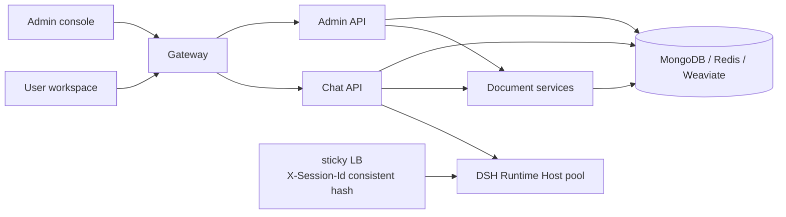

<p align="center">
  
</p>

<h1 align="center">MOGO</h1>

<p align="center">
  An enterprise Agent platform built on DeepSeek Harness (DSH), developed from the open-source MOVO platform.
</p>

<p align="center">
  <strong>English</strong> · <a href="README.zh-CN.md">简体中文</a>
</p>

<p align="center">
  <a href="#start-in-5-minutes"><strong>🚀 Quick Start</strong></a> ·
  <a href="docs/企业级智能体功能补强规划.md"><strong>📐 Capability Roadmap</strong></a> ·
  <a href="docs/SDD界面呈现对照表.md"><strong>🔍 SDD Traceability</strong></a> ·
  <a href="docs/cases/README.md"><strong>🧩 Cases</strong></a>
</p>

<br>

MOGO is an enterprise Agent platform built on top of the open-source MOVO platform. It keeps the execution foundation and product surface MOVO already proved, and carries them into enterprise production along three lines: **adopting the spec-kit SDD workflow**, **hardening enterprise capabilities**, and **supporting horizontal scaling of Agent instances**.

> **In one sentence:** DSH runs the Agent; MOGO brings the Agent into enterprise production.

<br>

<p align="center">
  
</p>

<br>

This repository contains the self-hosted MOGO Open-Source Edition.

## Relationship to open-source MOVO

MOGO is not a platform written from scratch. It is the enterprise evolution of MOVO, a comparatively complete starting point. Five capabilities MOVO already proved are treated as a "do not rebuild" boundary:

| Capability MOVO leads on | What it provides |
| --- | --- |
| Containerised self-hosting | One-command multi-service Docker Compose deployment, CLI launcher and backup/restore — the production operations base is ready |
| Docling multi-format parsing | PDF / DOCX / XLSX / PPTX / CSV plus LibreOffice preview, with complete document understanding |
| Content and file generation | Reports, articles, PPTX, spreadsheets, PDF, translation and form filling — a clear differentiator against comparable solutions |
| Multiple Agent forms | Browser Agent, Code Agent and sub-agents (desktop), covering rich execution shapes |
| SkillHub ecosystem | Enterprise knowledge research, citation evidence, Skill marketplace and ZIP installation — the knowledge loop and distribution model are in place |

MOGO only **adds** on top of these five; every new capability belongs to one of the three lines below.

## Line one: the spec-kit SDD workflow

MOGO adopts [spec-kit](https://github.com/github/spec-kit) Spec-Driven Development so that every capability addition becomes a traceable specification asset instead of a scattering of commit history.

The `.specify/` and `specs/` directories carry that contract:

```text
.specify/                 # spec-kit workflows, templates and project constitution
  memory/constitution.md  #   constitution: agent operating rules, boundaries, quality gates
  templates/              #   spec / plan / tasks templates
  scripts/bash/           #   create-new-feature, setup-plan and friends
  workflows/speckit/      #   workflow registry

specs/                    # 19 feature specifications, each with a complete chain
  001-gatekeeper-governance/
  ...
  019-harness-elastic-config/
  INDEX.md                # specification index
```

Each feature directory holds `spec.md` (requirements and acceptance), `plan.md` (technical approach), `checklists/requirements.md` (quality checklist) and — for the 15 gap-closing features (001/002/007–019) — `tasks.md` (checkable tasks) and, where a T998 interface contract applies, `contracts/` (5 top-level `contracts/*.md` plus 4 per-spec contract files). **All 15 `tasks.md` files (270 items) are checked off**, with implementation and tests landed together; the 4 retrospective features (003–006, re-documenting capabilities MOVO already had) keep their original `spec.md` + `plan.md` + checklist state without `tasks.md`.

The payoff is that every enterprise capability has a documented requirement source, acceptance criteria and test evidence. The mapping from specifications to UI touch points is recorded in [`docs/SDD界面呈现对照表.md`](docs/SDD界面呈现对照表.md).

## Line two: enterprise capability hardening

The hardening backlog comes from [`docs/企业级智能体功能补强规划.md`](docs/企业级智能体功能补强规划.md) and is sequenced P0 → P1 → P2. **All 15 backlog items are implemented and covered by tests** (the governance item itself spans several sub-capabilities: the six-layer gate, the risk matrix, permission codes and redaction). "Implemented" here means library code plus unit tests, all green; four of them (the 001 six-layer gate on the runtime side, 007 gateway resilience, 009 hooks, 002 session versioning) have completed **production wiring + UI delivery** — see the wiring notes in [`docs/SDD界面呈现对照表.md`](docs/SDD界面呈现对照表.md) §4.

### P0 — the compliance entry ticket: production availability

| Capability | What it delivers |
| --- | --- |
| **Gatekeeper six-layer gate** | Identity → RBAC → redaction → approval → quota → audit as one serial chain. R4 red-line actions cannot be overridden by any layer. |
| **Risk grading and autonomy matrix** | R0–R4 tool risk tiers plus an L1–L5 × R0–R4 autonomy matrix (25 cells) that turns ad-hoc "approve the sensitive tool" prompts into systematic, graded delegation of authority. |
| **Fine-grained RBAC permission codes** | `<resource>:<action>[:<target>]` codes with three-level isolation and fail-closed behaviour, replacing coarse job-role checks. |
| **PII redaction** | Private keys, national IDs, bank cards and phone numbers handled by `mask` / `remove` / `hash` / `abstract` policies — applied both at runtime and when a session is saved or shared, with reversible placeholders and read-only clones. |
| **LLM gateway resilience** | Primary → standby failover, a degradation chain that steps down through fallback models, exponential-backoff retry, and usage and cost metering. |
| **Operations dashboard** | A four-dimension cockpit in the admin console: cost, usage, quality and trends. |

### P1 — reliable execution and session hand-off

| Capability | What it delivers |
| --- | --- |
| **Hooks interception** | Five lifecycle events (SessionStart / PreToolUse / PostToolUse / SessionEnd / MemoryCommit) with timeout protection, fail-closed semantics and declarative rules (`deny_tool` / `require_field` / `observe`). PreToolUse ships with tool > session > tenant precedence and a ≤5 s latency budget. |
| **DAG orchestration engine** | Four modes (sequential / supervisor / hybrid / graph), topological sorting with cycle detection, conditional skipping with tri-state fail-closed evaluation and tracing, and node-level exponential-backoff retry. |
| **Session and workflow versioning** | Session `commit` builds a linear timeline, one-time `share` links hand over requirements, discussion and execution context, and co-presence lets several people work in the same session. Workflow definitions are versioned through the orchestration engine. |

### P2 — scale-out ecosystem: nine self-evolving and ecosystem capabilities

The third tier of the backlog holds **nine** capabilities, all implemented and covered by tests:

| # | Capability | What it delivers | Spec |
| :-: | --- | --- | :-: |
| 1 | **Dream Cycle self-evolution** | Friction capture → candidate ranking → improvement MR (Jaccard ≥ 0.7, sample ≥ 5, draft intermediate state) plus low-adoption retirement (14 days / ≥20 exposures / <10%), with configurable end-to-end audit | [011](specs/011-dream-cycle-self-evolution/) |
| 2 | **A2A Agent interop gateway** | AgentCard (Dify-first) + three JSON-RPC methods + idempotent task ids + outbound client (30 s timeout / failover / backoff) with governance-refusal short-circuit | [012](specs/012-a2a-agent-gateway/) |
| 3 | **Multi-IM entry points** | ChannelRouter (register / enable / disable, read-only) + session-channel binding + webhook entry with unified audit | [013](specs/013-multi-im-entry/) |
| 4 | **Business-system semantic index** | Entity pointer index (never writes to business databases) reusing the retrieval client, with citation anchors on hits | [014](specs/014-business-semantic-index/) |
| 5 | **Knowledge graph layer** | Nodes and edges with multi-hop traversal (CycleGuard) and mutual-exclusion / transitive / cardinality constraints (flagged, not blocking) | [015](specs/015-knowledge-graph-layer/) |
| 6 | **Skill marketplace hardening + consolidation loop** | Quality scoring, rollback and low-quality marking; the loop connects session → experience → Skill draft | [016](specs/016-skill-market-hardening/) |
| 7 | **Three-scope memory** | personal / workspace / org visibility with promotion authorization, 30-day decay and scope-filtered RAG ordering | [017](specs/017-three-scope-memory/) |
| 8 | **Capability asset registration** | Four-part contract, scan de-duplication, governance views, status approval and the `a2a_exposed` marker | [018](specs/018-capability-asset-registration/) |
| 9 | **Elastic Harness profiles** | Three-layer profile override chain, layer switches and a compliance floor (R4 always denied) wired into the Gatekeeper | [019](specs/019-harness-elastic-config/) |

Together these nine point at the same target: stringing **session → experience → Skill** into one line, so that one person's session becomes the starting point for a team and for later automation.

## Line three: multi-instance Agent runtime

In a single-instance deployment the Node DSH Runtime Host keeps kernel session state in process memory. Scale it out and any session request load-balanced to a different replica can no longer find its session.

MOGO implements the layer-A **sticky routing** design from [`docs/open-source-productization/agent-multi-instance-evaluation.md`](docs/open-source-productization/agent-multi-instance-evaluation.md):

- **Consistent hashing on `kernel_session_id`** — every request carries `X-Session-Id`, and a fronting nginx pins that session to one replica with `hash $http_x_session_id consistent`
- **Stable hashing** — `hashlib.sha256` rather than the process-randomised builtin `hash`, so a session still lands on the same replica after a restart
- **Backwards compatible** — with a single Runtime Host configured, behaviour is identical to before
- **Configuration** — `DSH_RUNTIME_HOSTS_URL` (comma separated) declares the replica list; `docker-compose.yml` ships three replicas plus the sticky LB

Contract tests cover hash stability and distribution, single-URL backwards compatibility, header propagation, and a **50 concurrent request × 3 replica session-affinity check**.

## Cases

[`docs/cases/`](docs/cases/README.md) holds two runnable end-to-end cases showing how MOGO's capabilities combine in real work. Both are covered by end-to-end tests that need neither an external LLM nor network access.

| Case | Type | Core capabilities |
| --- | --- | --- |
| [**Customer feedback triage**](docs/cases/single-agent-customer-feedback-triage.md) | Single agent · single Skill | Document parsing · Spreadsheet · RAG · PII redaction · approval · audit · cost dashboard |
| [**Competitor deep dive**](docs/cases/multi-agent-competitor-deep-dive.md) | Multi-agent · DAG graph | DAG orchestration · parallel execution · conditional skipping · failure propagation · report synthesis · cost aggregation |

**One is single-agent and the other multi-agent**, which illustrates the selection rule: use a single agent when the task boundary is clear and sub-tasks depend on each other in sequence; pay the context-rebuild cost of multiple agents only when sub-tasks have genuinely independent data sources and analysis modes.

### Case one: customer feedback triage

Support teams receive hundreds of items a day across tickets, email, community channels and in-app reports. Manual triage is slow and easy to let urgent issues slip. The case turns a batch of feedback (Excel / CSV / text) into a structured triage report in one pass: P0–P3 grading, module categorisation, identification of items needing immediate response, follow-up summaries, and an approval event once P0 volume crosses a threshold.

It ships a `customer_feedback_triage` Skill (templates, scripts and a validation contract) plus a runnable triage runtime, covering batch performance, P0 recall, zero PII leakage, approval triggering, cost accounting, audit completeness, session resume and Skill-package installability.

### Case two: competitor deep dive

Strategy teams need recurring deep research covering market, product, financial and sentiment dimensions — two to three weeks of manual work. The case orchestrates four parallel analysis sub-agents as a **DAG graph**, then a synthesis node cross-references their outputs into an analyst-grade report:

- The four analysis nodes **run in parallel** (their data sources are independent); the synthesis node waits for all of them
- **Conditional skipping**: financial analysis is skipped for a private competitor, with the reason stated in the report
- **Failure propagation**: one sub-agent failing does not stop the others; when fewer than three complete, the synthesis node is skipped and a degraded report is emitted instead of a misleading conclusion
- **Traceable evidence**: every claim carries an evidence id that can be looked up

This required a new YAML orchestration loader, so orchestration definitions can be maintained as declarative documents with topology and condition syntax validated at load time.

## Start in 5 minutes

With Git and Docker Desktop (or Docker Engine with Docker Compose v2) installed:

```bash
git clone https://github.com/himovo/movo.git
cd movo
chmod +x movo
./movo up
```

Then open:

```text
http://localhost:3000/admin/setup
```

The launcher pulls the official prebuilt images, waits for the services to become healthy and prints the setup address. No `.env` file or local image build is required. Windows users should run MOGO inside an Ubuntu WSL 2 distribution; see the [Windows installation guide](docs/windows-installation.md).

## Open-Source Edition

A tenant created by the self-hosted setup flow is marked as `community`:

- no member-count limit;
- billing and commercial plan enforcement are disabled;
- self-managed model connections are enabled;
- data and runtime services remain in your own deployment.

The repository includes the Web user workspace, administration console, conversation and Agent APIs, DSH Runtime Host, document parser and retrieval services, and Docker deployment configuration.

### Browser Agent and Code Agent

The self-hosted Web workspace supports chat, research, knowledge, files and content generation. To use **Browser Agent** or **Code Agent**, install the MOGO desktop client and connect it to your self-hosted MOGO service.

The desktop client provides the local browser session, code workspace, project terminal and Git integration these capabilities require. It is distributed separately as proprietary software; its source code is not included in this repository.

| Capability | Self-hosted Web | Desktop client |
| --- | :---: | :---: |
| Chat, research and enterprise knowledge | ✓ | ✓ |
| Document understanding and content generation | ✓ | ✓ |
| Browser Agent | — | ✓ |
| Code Agent, local projects, terminal and Git | — | ✓ |
| Requires a self-hosted MOGO service | ✓ | ✓, connects to that service |
| Source included in this repository | ✓ | —, distributed separately |

## Architecture



The default Docker Compose deployment starts the gateway, two Web applications, three application APIs, the DSH Runtime Host (multiple replicas behind a sticky load balancer), a document worker, MongoDB, Redis, Weaviate and a one-time secret bootstrap service.

## Deployment and operations

### Requirements and platform notes

- Git
- Docker Desktop, or Docker Engine with Docker Compose v2
- at least 8 GB of available memory
- at least 20 GB of available disk space for images and application data
- network access to GHCR and Docker Hub during the initial image pull
- credentials for at least one compatible model API to complete setup

The quick-start command above works on Linux and macOS. `./movo up` pulls the published images sequentially and keeps retrying network failures until the pull succeeds or the user presses `Ctrl+C`. The first startup downloads several container images and can take some time. Normal users do **not** need to build the images locally.

On Windows, use Docker Desktop with WSL 2 and Ubuntu. Check that Ubuntu exists with `wsl -l -v`, then enter it explicitly with `wsl -d Ubuntu`; do not run MOGO from a prompt beginning with `docker-desktop:`. See the complete [Windows installation guide](docs/windows-installation.md).

You can also start the same official prebuilt images directly with `docker compose up -d`, including from Windows PowerShell or Command Prompt. Neither command requires an `.env` file, but native Compose pulls in parallel and does not provide the launcher's retry loop or readiness wait. To build and start local images from source instead, use `./movo up --build`.

After setup:

| Entry | Default URL | Purpose |
| --- | --- | --- |
| User workspace | `http://localhost:3000/` | Conversations, research, knowledge, files and content generation |
| Admin console | `http://localhost:3000/admin/` | Users, models, knowledge, Skills, Tools and governance |
| Setup wizard | `http://localhost:3000/admin/setup` | First-run initialization only |

The setup wizard checks the deployment and guides you through creating the organization and initial accounts, connecting a default chat model, and optionally configuring embedding, reranking, vision, image generation and Web search providers. Provider credentials are encrypted before storage.

### Common operations

```bash
./movo status
./movo logs chat-api
./movo restart
./movo update
./movo backup /path/on/a/large-disk/movo-backup
./movo down       # Stop containers and preserve data
./movo down -v    # Permanently delete MOGO data after confirmation
```

For production, pin a release tag instead of using `latest`. See [Docker deployment](docs/docker-deployment.md) for image selection, upgrades, backup and restore, reverse proxy configuration and the production baseline.

### Horizontal scaling

The DSH Runtime Host supports multiple replicas, pinned per session by the fronting sticky load balancer:

```env
# Comma separated Runtime Host replicas; empty falls back to DSH_RUNTIME_HOST_URL
DSH_RUNTIME_HOSTS_URL=http://dsh-runtime-host-1:8101,http://dsh-runtime-host-2:8101,http://dsh-runtime-host-3:8101
```

`docker-compose.yml` ships a reference configuration with three replicas and the sticky LB; the LB rules live in `deploy/docker/dsh-runtime-lb.conf`. Adding a replica means extending `DSH_RUNTIME_HOSTS_URL` and adding the matching service.

### DSH runtime version

MOGO pins the DeepSeek Harness (DSH) Agent kernel to an exact release train rather than a floating range, so a rebuild cannot silently change Agent behavior:

| Item | Value |
| --- | --- |
| DSH release train | `0.1.7-rc.2` |
| Pinned packages | 17 `@deepseek-ai/dsh*` packages in `services/chat-api/dsh/runtime-host/package.json` |
| Node runtime | `^22.19.0 \|\| >=24.0.0` |
| Host protocol | `askai.dsh-host.v1` |
| Host overlay | `askai-dsh-host-v1` |

The authoritative declaration lives in [`services/chat-api/dsh/compatibility-matrix.yaml`](services/chat-api/dsh/compatibility-matrix.yaml); the resolved dependency graph is locked in `services/chat-api/dsh/runtime-host/pnpm-lock.yaml`, and `versions.lock` plus `sbom.cdx.json` under `services/chat-api/dsh/` are regenerated alongside it. Prebuilt images already carry the pinned kernel, so a normal `./movo update` does not change the DSH train.

**Upgrading the DSH train** is a source change, because the kernel is a build-time dependency:

1. Update the pinned versions in `services/chat-api/dsh/runtime-host/package.json`, refresh that directory's `pnpm-lock.yaml`, then regenerate `versions.lock` and `sbom.cdx.json` under `services/chat-api/dsh/`.
2. Update `active_release` and `supported_releases` in `compatibility-matrix.yaml`. Keep the previous train listed so a rollback image still has a declared contract.
3. Rebuild the Runtime Host image and rebuild from source (`./movo up --build`).
4. Run the guard tests before deploying: `services/chat-api/dsh/runtime-host` (`node --test tests/*.test.mjs`) and `services/chat-api/tests/dsh_runtime/test_dsh_upgrade_contract.py`, which fails when the matrix, `package.json` and the shipped web app disagree.

Treat a train upgrade as a compatibility change, not a patch bump. DSH releases have historically renamed preset mechanisms, changed tool-result message shapes, and tightened plugin visibility rules; each of those can break a host overlay that still boots successfully. When upgrading, diff the host plane the new train ships before assuming the old overlay still applies — the `0.1.6-alpha.1` → `0.1.7-rc.2` move required the overlay to re-emit the disabled rows the official web-app patch declares. `docs/WORK_LOG.md` records the concrete breakages found in that move, and `docs/DSH-0.1.7-skill-catalog-定位报告.md` documents one of them end to end.

### Configuration

The default local deployment does not require an `.env` file. To change the public port, canonical URL, image version or volume prefix:

```bash
cp .env.example .env
```

```env
MOVO_PORT=3000
MOVO_VOLUME_PREFIX=movo
MOVO_IMAGE_REGISTRY=ghcr.io/himovo
MOVO_VERSION=vX.Y.Z
PUBLIC_BASE_URL=https://movo.example.com
```

Keep `MOVO_VOLUME_PREFIX` stable after first startup. DNS, TLS certificates and the external reverse proxy remain the deployment operator's responsibility.

## Build from source

Building locally is intended for contributors and developers:

```bash
./movo up --build
```

To build the images without starting the services:

```bash
./movo build
```

Source builds download Playwright, LibreOffice, Docling and model assets, so they need substantially more time and disk space than the prebuilt-image path.

## Repository layout

| Path | Component |
| --- | --- |
| `specs/` | spec-kit SDD specification assets (19 features) |
| `.specify/` | spec-kit workflows, templates and project constitution |
| `apps/user-web/` | Vue 3 user workspace |
| `apps/admin-web/` | Vue 3 setup and administration console |
| `services/chat-api/` | FastAPI conversation, task, Agent, Skill and DSH gateway |
| `services/chat-api/dsh/runtime-host/` | Node.js DSH Runtime Host |
| `services/admin-api/` | FastAPI organization, user, model and platform management API |
| `services/document-parser/` | Document parsing, preview, retrieval API and worker |
| `deploy/` | Bootstrap scripts, gateway and sticky LB configuration |
| `docs/` | Capability roadmap, SDD traceability, cases and operations docs |

## Contributing and support

Issues and feature requests are welcome. Clear use cases and reproducible feedback may be implemented quickly when they benefit the wider community.

- [GitHub Discussions](https://github.com/himovo/movo/discussions) for questions, ideas and deployment experience
- [GitHub Issues](https://github.com/himovo/movo/issues) for reproducible bugs
- [Contribution guide](CONTRIBUTING.md)
- [Security policy](SECURITY.md)
- [Community support policy](SUPPORT.md)
- [Maintainer release process](docs/release-process.md)
- Security, commercial licensing and support: `support@himovo.com`

Before submitting a change, run the relevant checks described in [CONTRIBUTING.md](CONTRIBUTING.md). At minimum, the repository hygiene check is:

```bash
python3 scripts/check_open_source_hygiene.py
```

## License

MOGO Open-Source Edition is source-available under the [MOVO Community License](LICENSE), based on Apache License 2.0 with additional conditions. Without written authorization, the license does not permit operating a hosted multi-tenant SaaS offering, removing or modifying the logo and copyright notices in the included frontends, or selling MOGO or a derivative as an OEM, white-label, or rebranded enterprise Agent platform whose primary product is MOGO itself.

These additional restrictions mean that the MOVO Community License is not the unmodified Apache License 2.0 and should not be represented as an OSI-approved open-source license. For commercial licensing, multi-tenant SaaS authorization, OEM or white-label distribution, or alternative branding rights, contact `support@himovo.com`.
