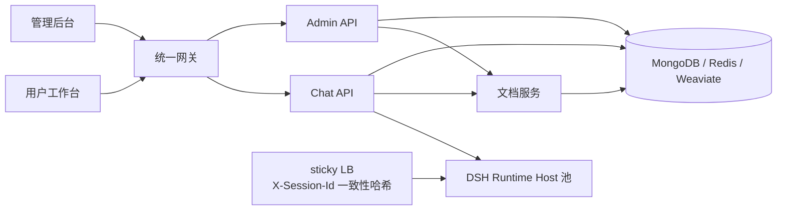

<p align="center">
  
</p>

<h1 align="center">墨攻 MOGO</h1>

<p align="center">
  基于 DeepSeek Harness（DSH）的企业级智能体平台，在开源 MOVO 基础上构建。
</p>

<p align="center">
  <a href="README.md">English</a> · <strong>简体中文</strong>
</p>

<p align="center">
  <a href="#5-分钟快速启动"><strong>🚀 快速开始</strong></a> ·
  <a href="docs/MOVO企业级智能体功能补强规划.md"><strong>📐 功能补强规划</strong></a> ·
  <a href="docs/SDD界面呈现对照表.md"><strong>🔍 SDD 界面呈现对照表</strong></a> ·
  <a href="docs/cases/README.md"><strong>🧩 落地案例</strong></a>
</p>

<br>

墨攻（MOGO）是在开源 MOVO 平台基础上构建的企业级智能体平台。它保留 MOVO 已验证的执行底座与产品形态，并沿三条主线推进到企业生产：**引入 spec-kit SDD 开发规范**、**补强企业级功能**、**支持智能体多实例横向扩展**。

> **一句话理解墨攻：** DSH 负责智能体如何运行，墨攻负责智能体如何进入企业生产环境。

<br>

<p align="center">
  
</p>

<br>

本仓库包含可私有化部署的墨攻社区版。

## 与开源 MOVO 的关系

墨攻不是从零开始的新平台，而是站在 MOVO 这个较完整起点上的企业化演进。已在 MOVO 验证并**明确不重复投入**的五块能力，作为"不重复造轮子"的边界：

| 已领先的能力 | 说明 |
| --- | --- |
| 容器化自托管部署 | Docker Compose 一键启动多服务 + CLI 启动器 + 备份/恢复，生产运维底座已就绪 |
| Docling 多格式解析 | PDF / DOCX / XLSX / PPTX / CSV + LibreOffice 预览，文档理解能力完整 |
| 内容与文件生成 | 报告 / 文章 / PPTX / 表格 / PDF / 翻译 / 表单填写，是相对同类方案的差异化强项 |
| 多形态 Agent | 浏览器 Agent、代码 Agent、子智能体（桌面端），执行形态丰富 |
| SkillHub 生态 | 企业知识研究、引用证据、Skill 市场 + ZIP 安装，知识闭环与生态分发已成型 |

墨攻在这五块之上**只做加法**，新增能力集中在下面三条主线。

## 主线一：spec-kit SDD 开发规范

墨攻引入 [spec-kit](https://github.com/github/spec-kit) 的规格驱动开发（Spec-Driven Development）流程，把每一项功能补强都固化成可追溯的规格资产，而不是散落在提交记录里。

仓库中的 `.specify/` 与 `specs/` 承载这套规范：

```text
.specify/                 # spec-kit 工作流、模板与项目宪法
  memory/constitution.md  #   项目宪法：代理操作规则、边界与质量约束
  templates/              #   spec / plan / tasks 模板
  scripts/bash/           #   create-new-feature、setup-plan 等脚本
  workflows/speckit/      #   工作流注册表

specs/                    # 19 个特性规格，每个含完整规格链路
  001-gatekeeper-governance/
  ...
  019-harness-elastic-config/
  INDEX.md                # 规格索引
```

每个特性目录包含 `spec.md`（需求与验收）、`plan.md`（技术方案）、`tasks.md`（可勾选任务）、`checklist.md`（质量清单）与 `contracts/`（接口契约）。**19 个特性的 tasks 已全部勾选完成**，实现、测试与契约同步落地。

这样做的收益是：每一条企业能力都有对应的需求来源、验收标准与测试证据，界面触点与规格的映射关系记录在 [`docs/SDD界面呈现对照表.md`](docs/SDD界面呈现对照表.md)。

## 主线二：企业级功能补强

补强清单来自 [`docs/MOVO企业级智能体功能补强规划.md`](docs/MOVO企业级智能体功能补强规划.md)，按 P0 → P1 → P2 三档优先级推进。规划中的 15 个清单项（其中治理与风控层含六层门禁、风险矩阵、权限码、脱敏等子能力）**已全部实现并通过测试**。

### P0 —— 企业入场券：合规刚需与生产可用性

| 能力 | 交付内容 |
| --- | --- |
| **Gatekeeper 六层串行门禁** | 身份 → RBAC → 脱敏 → 审批 → 配额 → 审计串成一条门禁链；R4 红线动作不可被任何一层覆盖 |
| **风险分级与自主矩阵** | R0–R4 工具风险分级，配合 L1–L5 × R0–R4 自主级别矩阵（25 格），把零散的"敏感工具审批"升级为系统化、分级放权 |
| **细粒度 RBAC 权限码** | `<resource>:<action>[:<target>]` 权限码，支持三级隔离与 fail-closed，替代粗粒度的岗位角色判断 |
| **PII 脱敏** | 私钥 / 身份证 / 银行卡 / 手机号等按 `mask` / `remove` / `hash` / `abstract` 策略处理；运行时与会话保存/分享时双重生效，敏感内容替换为可逆占位符，clone 默认只读 |
| **LLM 网关韧性** | 主 → 备供应商 failover、逐级降档的 degradation chain、指数退避重试，以及用量与成本计量上报 |
| **运营驾驶舱** | 管理后台四维看板——成本、使用、质量、趋势 |

### P1 —— 可靠执行与会话交接

| 能力 | 交付内容 |
| --- | --- |
| **Hooks 拦截机制** | 五个生命周期事件（SessionStart / PreToolUse / PostToolUse / SessionEnd / MemoryCommit），配套超时保护、fail-closed 语义与声明式规则（`deny_tool` / `require_field` / `observe`）；PreToolUse 已实现 tool > session > tenant 规则优先级与 ≤5s 延迟预算 |
| **DAG 编排引擎** | 四种模式（sequential / supervisor / hybrid / graph）、拓扑排序与环检测、带三态 fail-closed 求值与追溯的条件跳过、节点级指数退避重试 |
| **会话与工作流双版本化** | 会话 `commit` 形成线性时间线，一次性 `share` 链接把需求、讨论与执行过程一并交接，共在线支持多人围绕同一会话协作；工作流定义通过编排引擎做版本化 |

### P2 —— 规模化生态：九项自进化与生态能力

这是补强清单的第三档，共 **9 项**，全部已实现并通过测试：

| # | 能力 | 交付内容 | 规格 |
| :-: | --- | --- | :-: |
| 1 | **Dream Cycle 自进化** | friction 捕获 → 候选排名 → 改进 MR（Jaccard ≥ 0.7 且样本 ≥ 5，draft 中间态）+ 低采纳退役（14 天 / ≥20 曝光 / <10%），全链路审计可配置 | [011](specs/011-dream-cycle-self-evolution/) |
| 2 | **A2A Agent 互通网关** | AgentCard（Dify 优先）+ JSON-RPC 三方法 + task id 幂等 + 出站客户端（30s 超时 / failover / 退避），治理拒绝短路 | [012](specs/012-a2a-agent-gateway/) |
| 3 | **多 IM 入口** | ChannelRouter（注册 / 启用 / 停用只读）+ 会话-渠道绑定 + webhook 入口 + 统一审计 | [013](specs/013-multi-im-entry/) |
| 4 | **业务系统语义索引** | 实体指针索引（不写业务库）+ 复用检索客户端，命中带 citation 锚点 | [014](specs/014-business-semantic-index/) |
| 5 | **知识图谱层** | 节点 / 边 + 多跳遍历（CycleGuard）+ 互斥 / 传递 / 基数约束（标记不阻断） | [015](specs/015-knowledge-graph-layer/) |
| 6 | **Skill 市场强化 + 沉淀闭环** | 质量打分 / 回滚 / 低质标记；沉淀闭环打通"会话 → 经验 → Skill 草稿" | [016](specs/016-skill-market-hardening/) |
| 7 | **三范围 Memory** | personal / workspace / org 三级可见性 + 升级授权 + 30 天衰减 + RAG 按 scope 过滤排序 | [017](specs/017-three-scope-memory/) |
| 8 | **能力资产化"发现→注册"** | 契约四段 + 扫描去重 + 治理视图 + 状态审批 + `a2a_exposed` 标记 | [018](specs/018-capability-asset-registration/) |
| 9 | **厚/薄 Harness 弹性配置** | profile 三层覆盖链 + 层开关 + 合规底线（R4 恒 deny）+ 与 Gatekeeper 对接 | [019](specs/019-harness-elastic-config/) |

这九项共同指向"Agent 越用越聪明"的目标形态：把**会话 → 经验 → Skill** 串成主线，让一个人的会话成为团队与后续自动化的起点。

## 主线三：智能体多实例运行改造

单实例部署下，Node DSH Runtime Host 把 kernel 会话状态保存在进程内存中——一旦横向扩展，同一个会话的请求被负载均衡到另一台实例就会找不到会话。

墨攻按 [`docs/open-source-productization/agent-multi-instance-evaluation.md`](docs/open-source-productization/agent-multi-instance-evaluation.md) 的层 A 方案落地了 **sticky 路由**：

- **按 `kernel_session_id` 一致性哈希**：每个请求携带 `X-Session-Id`，前置 nginx 以 `hash $http_x_session_id consistent` 把同一会话固定到同一实例
- **哈希稳定**：使用 `hashlib.sha256` 而非进程内随机的内置 `hash`，重启后同一会话仍落到同一实例
- **向后兼容**：仅配置单个 Runtime Host 时，行为与改造前完全一致
- **配置**：`DSH_RUNTIME_HOSTS_URL`（逗号分隔）声明实例列表，`docker-compose.yml` 提供三副本 + sticky LB

契约测试覆盖哈希稳定性与分布、单 URL 向后兼容、请求头注入，以及 **50 并发 × 3 实例的会话亲和性验证**。

## 落地案例

[`docs/cases/`](docs/cases/README.md) 收录了两个可运行的完整案例，用于说明墨攻的能力如何组合成真实业务场景。两个案例都配有端到端测试，运行时不依赖外部 LLM 或网络。

| 案例 | 类型 | 核心能力 |
| --- | --- | --- |
| [**客户反馈智能分诊**](docs/cases/single-agent-customer-feedback-triage.md) | 单智能体 · 单 Skill | 文档解析 · Spreadsheet · RAG · PII 脱敏 · 审批 · 审计 · 成本驾驶舱 |
| [**竞品深度调研**](docs/cases/multi-agent-competitor-deep-dive.md) | 多智能体 · DAG graph | DAG 编排 · 并行执行 · 条件跳过 · 失败传播 · 报告合成 · 成本聚合 |

**一个是单智能体、一个是多智能体**，正好说明选型判断：任务边界清晰、子任务顺序依赖时用单智能体；子任务之间有独立数据源与分析模式时，才值得付出多智能体的上下文重建成本。

### 案例一：客户反馈智能分诊

客服团队每天收到数百条来自工单、邮件、社群与应用内的反馈，人工分诊耗时且容易埋没紧急问题。该案例把一批反馈（Excel / CSV / 文本）一次处理成结构化分诊报告：按 P0–P3 分级、按模块归类、识别需立即响应的项、生成跟进摘要，并在 P0 达到阈值时触发审批。

交付物为 `customer_feedback_triage` Skill（含模板、脚本与校验契约）与可运行的分诊运行时，覆盖批量性能、P0 召回率、PII 零泄漏、审批触发、成本入账、审计完整、会话可 resume、Skill 包可安装等验收标准。

### 案例二：竞品深度调研

战略团队定期需要覆盖市场、产品、财务、舆情四个维度的竞品深度报告，人工完成需 2–3 周。该案例以 **DAG graph** 编排四个并行分析子智能体，再由汇总节点交叉引用并输出 analyst-grade 报告：

- 四个分析节点**并行执行**（数据源互不依赖），汇总节点等待全部完成后触发
- **条件跳过**：竞品为私有公司时自动跳过财务分析，并在报告中说明原因
- **失败传播**：单个子节点失败不影响其余节点；完成数少于 3 个时汇总节点跳过并输出降级报告，而不是给出误导性结论
- **证据可追溯**：报告所有主张附证据 ID，可反查

为此墨攻新增了 YAML 编排加载器，使编排定义可以作为声明式文档维护，并在加载期校验拓扑与条件语法。

## 5 分钟快速启动

安装 Git 和 Docker Desktop（或 Docker Engine 与 Docker Compose v2）后执行：

```bash
git clone https://github.com/himovo/movo.git
cd movo
chmod +x movo
./movo up
```

然后打开：

```text
http://localhost:3000/admin/setup
```

启动器会拉取官方预构建镜像、等待服务就绪并打印初始化地址，无需准备 `.env` 文件或本地构建镜像。Windows 用户请在 Ubuntu WSL 2 发行版中运行墨攻，参见 [Windows 安装指南](docs/windows-installation.zh-CN.md)。

## 社区版说明

通过私有化初始化流程创建的租户会被标记为 `community`：

- 不限制成员数量；
- 不启用计费和商业套餐限制；
- 支持自行配置模型服务；
- 数据和运行服务保留在部署者自己的环境中。

本仓库包括用户工作台、管理后台、对话与 Agent API、DSH Runtime Host、文档解析与检索服务，以及完整的 Docker 部署配置。

### 浏览器 Agent 与 Code Agent

私有化部署的 Web 工作台支持对话、研究、知识、文件和内容生成。如需使用**浏览器 Agent** 或 **Code Agent**，请下载安装墨攻桌面端，并将它连接到你自行部署的墨攻服务。

桌面端为这些能力提供本地浏览器会话、代码工作区、项目终端和 Git 集成，是独立分发的专有软件，源码不包含在本仓库中。

| 能力 | 私有化 Web 端 | 桌面端 |
| --- | :---: | :---: |
| 对话、研究与企业知识 | ✓ | ✓ |
| 文档理解与内容生成 | ✓ | ✓ |
| 浏览器 Agent | — | ✓ |
| Code Agent、本地项目、终端与 Git | — | ✓ |
| 是否需要私有化部署墨攻服务 | ✓ | ✓，连接该服务 |
| 源码是否包含在本仓库 | ✓ | —，独立分发 |

## 系统架构



默认 Docker Compose 部署会启动网关、两个 Web 应用、三个应用 API、DSH Runtime Host（多副本 + sticky LB）、文档 Worker、MongoDB、Redis、Weaviate 以及一次性的密钥引导服务。

## 部署与运维

### 环境要求与平台说明

- Git
- Docker Desktop，或 Docker Engine 与 Docker Compose v2
- 至少 8 GB 可用内存
- 至少 20 GB 可用磁盘空间（用于镜像与应用数据）
- 首次拉取镜像时可访问 GHCR 与 Docker Hub
- 至少一个可用模型 API 的凭据，用于完成初始化

上面的快速启动命令适用于 Linux 与 macOS。`./movo up` 会依次拉取官方镜像，并在网络失败时持续重试，直到成功或用户按 `Ctrl+C`。首次启动需要下载多个镜像，访问 GHCR 或 Docker Hub 较慢时耗时会更长。普通用户**不需要**在本地构建镜像。

Windows 用户请使用 Docker Desktop 配合 WSL 2 与 Ubuntu。可以先用 `wsl -l -v` 确认 Ubuntu 存在，再用 `wsl -d Ubuntu` 显式进入；不要在 `docker-desktop:` 开头的提示符下运行。完整步骤见 [Windows 安装指南](docs/windows-installation.zh-CN.md)。

你也可以直接用 `docker compose up -d` 启动同一套官方镜像（包括在 Windows PowerShell 或命令提示符中）。两种方式都不需要 `.env` 文件，但原生 Compose 会并行拉取，且不提供启动器的持续重试与就绪等待。如果要从源码构建并启动本地镜像，使用 `./movo up --build`。

初始化完成后可访问：

| 入口 | 默认地址 | 用途 |
| --- | --- | --- |
| 用户工作台 | `http://localhost:3000/` | 对话、研究、知识、文件与内容生成 |
| 管理后台 | `http://localhost:3000/admin/` | 组织、用户、模型、知识、Skill、工具与治理 |
| 初始化向导 | `http://localhost:3000/admin/setup` | 仅用于首次初始化 |

初始化向导会检查部署状态，并引导你创建组织与初始账号、连接默认对话模型，以及按需配置 embedding、rerank、视觉、图像生成与网络搜索服务。凭据在存储前会加密。

### 常用运维命令

```bash
./movo status
./movo logs chat-api
./movo restart
./movo update
./movo backup /path/to/large-disk/movo-backup
./movo down       # 停止容器并保留数据
./movo down -v    # 确认后永久删除墨攻数据
```

生产环境建议固定发布标签，而不是使用 `latest`。镜像选择、升级、备份恢复、反向代理与生产基线参见 [Docker 部署](docs/docker-deployment.md)。

### 多实例横向扩展

DSH Runtime Host 支持多副本运行，由前置 sticky 负载均衡按会话固定实例：

```env
# 逗号分隔的 Runtime Host 实例列表；留空则回退到 DSH_RUNTIME_HOST_URL
DSH_RUNTIME_HOSTS_URL=http://dsh-runtime-host-1:8101,http://dsh-runtime-host-2:8101,http://dsh-runtime-host-3:8101
```

`docker-compose.yml` 已提供三副本与 sticky LB 的参考配置，LB 规则见 `deploy/docker/dsh-runtime-lb.conf`。增加副本时同时补充 `DSH_RUNTIME_HOSTS_URL` 与服务定义即可。

### 配置

默认本地部署不需要 `.env` 文件。如需修改对外端口、规范地址、镜像版本或卷前缀：

```bash
cp .env.example .env
```

```env
MOVO_PORT=3000
MOVO_VOLUME_PREFIX=movo
MOVO_IMAGE_REGISTRY=ghcr.io/himovo
MOVO_VERSION=vX.Y.Z
PUBLIC_BASE_URL=https://movo.example.com
```

首次启动后请保持 `MOVO_VOLUME_PREFIX` 不变。DNS、TLS 证书与外部反向代理由部署方负责。

## 从源码构建

本地构建面向贡献者与开发者：

```bash
./movo up --build
```

只构建镜像而不启动服务：

```bash
./movo build
```

源码构建会下载 Playwright、LibreOffice、Docling 与模型资源，所需时间与磁盘空间明显高于直接使用预构建镜像。

## 仓库结构

| 路径 | 组件 |
| --- | --- |
| `specs/` | spec-kit SDD 规格资产（19 个特性） |
| `.specify/` | spec-kit 工作流、模板与项目宪法 |
| `apps/user-web/` | Vue 3 用户工作台 |
| `apps/admin-web/` | Vue 3 初始化与管理后台 |
| `services/chat-api/` | FastAPI 对话、任务、Agent、Skill 与 DSH 网关 |
| `services/chat-api/dsh/runtime-host/` | Node.js DSH Runtime Host |
| `services/admin-api/` | FastAPI 组织、用户、模型与平台管理 API |
| `services/document-parser/` | 文档解析、预览、检索 API 与 Worker |
| `deploy/` | 引导脚本、网关与 sticky LB 配置 |
| `docs/` | 功能补强规划、SDD 对照表、案例与运维文档 |

## 参与贡献与支持

欢迎提交 Issue 与功能建议。清晰的使用场景与可复现反馈通常能较快落地。

- [GitHub Discussions](https://github.com/himovo/movo/discussions)：提问、想法与部署经验
- [GitHub Issues](https://github.com/himovo/movo/issues)：可复现的缺陷
- [贡献指南](CONTRIBUTING.md)
- [安全策略](SECURITY.md)
- [社区支持说明](SUPPORT.md)
- [发布流程](docs/release-process.md)
- 安全、商业授权与支持：`support@himovo.com`

提交变更前请先阅读 [CONTRIBUTING.md](CONTRIBUTING.md) 中的检查要求。仓库卫生检查至少需要执行：

```bash
python3 scripts/check_open_source_hygiene.py
```

## 许可证

墨攻社区版基于 [MOVO 社区许可证](LICENSE) 发布，该许可证以 Apache License 2.0 为基础并附加条件。未经书面授权，不得用于运营多租户托管 SaaS 服务，不得删除或修改所包含前端的标识与版权声明，也不得将本项目或其衍生作品作为以本项目为主要产品的 OEM、白标或贴牌企业级 Agent 平台进行销售。

由于上述附加条件，MOVO 社区许可证并非未经修改的 Apache License 2.0，也不应被表述为经 OSI 认证的开源许可证。如需商业授权、多租户 SaaS 授权、OEM 或白标分发，请联系 `support@himovo.com`。
