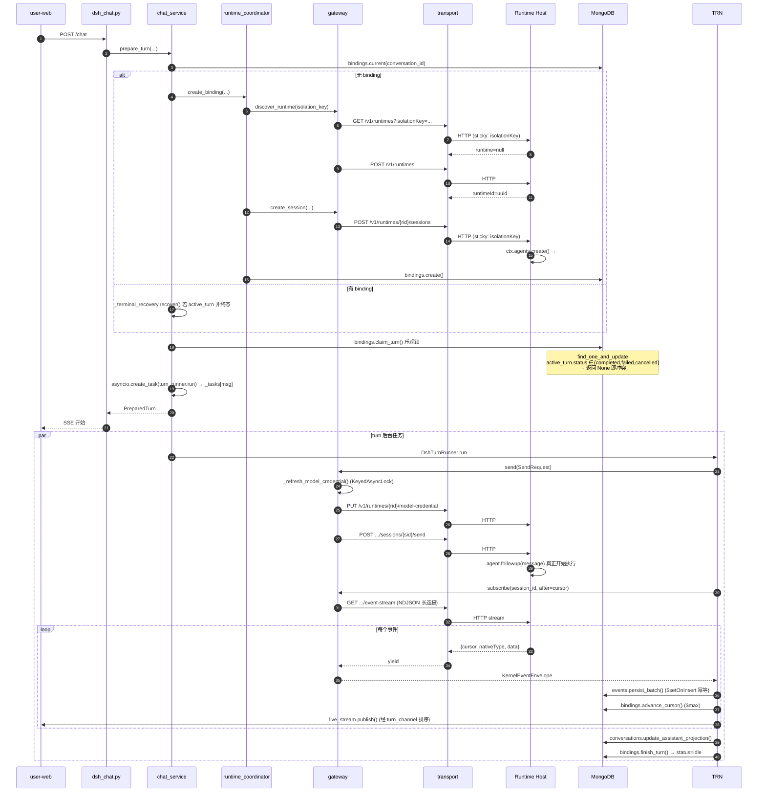
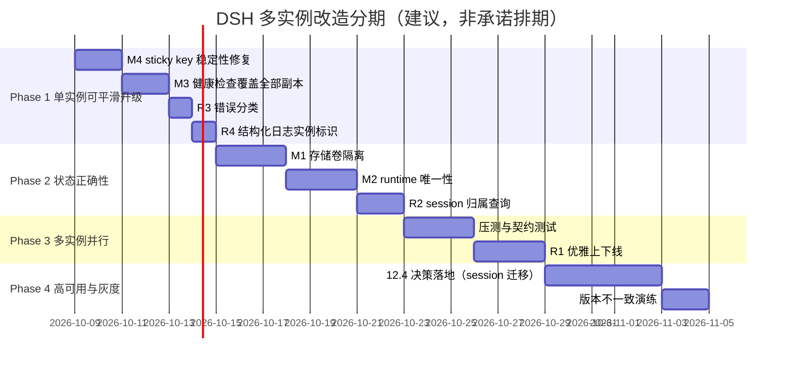
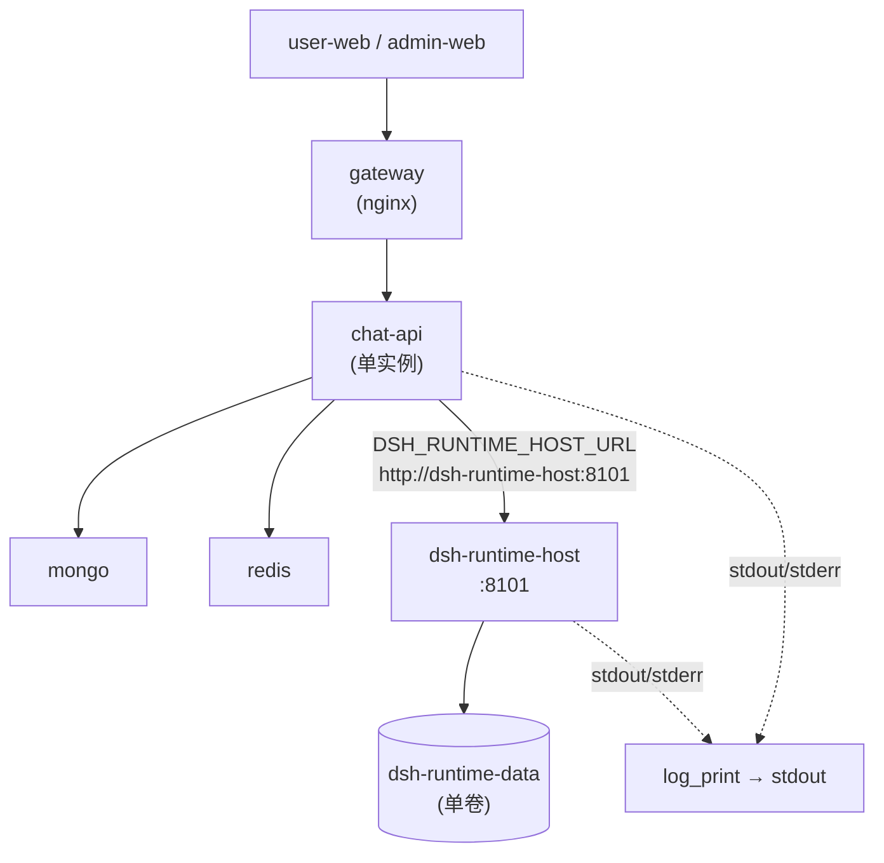
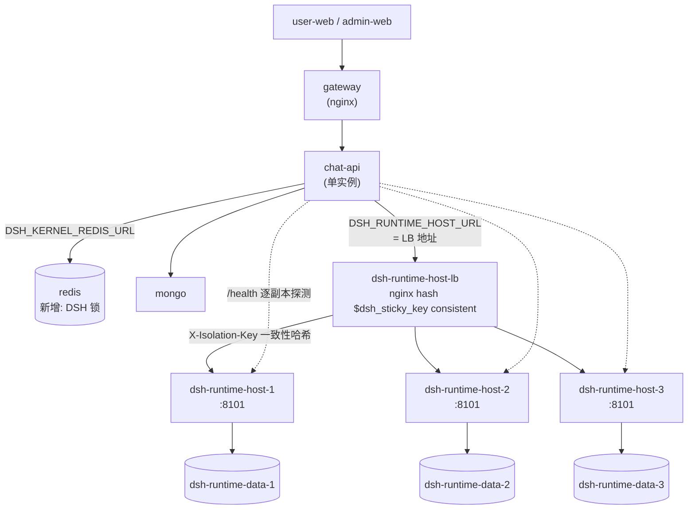

# DSH 多实例运行改造说明

> **文档类型**：技术现状调研 + 改造方案
> **调研日期**：2026-10-08
> **代码基线**：`main` @ `dc35112`
> **调研范围**：`services/chat-api/dsh/runtime-host/`（Node 宿主）、`services/chat-api/app/dsh_runtime/`（Python 客户端/编排）、启动编排脚本、部署编排、版本兼容契约
> **调研方式**：全量精读源码，所有结论标注 `文件路径:行号` 证据

---

## 阅读约定（重要）

本文档严格区分「**现状**」与「**建议**」，请务必先识别标记再阅读：

| 标记 | 含义 |
|---|---|
| ✅ **【代码现状·已验证】** | 直接从源码读出的事实，附 `文件:行号`。未经实测运行验证的，明确写「未实测」 |
| 🟡 **【代码现状·实测】** | 源码事实 + 仓库内文档/测试记录表明曾被实际运行验证过（附证据出处） |
| 📝 **【建议方案·未实现】** | 本文档提出的设计，**当前代码中不存在**，不得当作已有能力引用 |
| ❓ **【推断】** | 无法从代码直接确认的判断，标注推断依据与置信度 |
| ⚠️ **【待确认】** | 需要人工/外部信息确认，代码无法回答 |

**本文档不含任何代码修改。** 所有"改造项"均为待实施建议。

**术语约定**：DSH = DeepSeek Harness（上游 `@deepseek-ai/dsh-*` npm 包族）；Runtime Host = Node 侧宿主进程（`dsh-runtime-host` 服务）；kernel = DSH 内核（`ASKAI_DSH_KERNEL_VERSION = 0.2.0-rc.2`）；turn = 一次对话轮次；session = 一次 kernel 会话（`kernel_session_id`）；runtime = 一个隔离的 kernel 实例（`runtime_id`）。

---

## 目录

1. [执行摘要](#1-执行摘要)
2. [DSH 架构全景](#2-dsh-架构全景)
3. [现状：单实例假设的完整清单](#3-现状单实例假设的完整清单)
4. [会话亲和性分析](#4-会话亲和性分析)
5. [存储与状态：多副本踩踏分析](#5-存储与状态多副本踩踏分析)
6. [并发与背压](#6-并发与背压)
7. [鉴权与租户隔离](#7-鉴权与租户隔离)
8. [可观测性与健康检查](#8-可观测性与健康检查)
9. [升级与灰度](#9-升级与灰度)
10. [目标形态与范围](#10-目标形态与范围)
11. [改造项清单](#11-改造项清单)
12. [关键设计决策](#12-关键设计决策)
13. [分阶段落地路线](#13-分阶段落地路线)
14. [风险登记册](#14-风险登记册)
15. [配置与运维手册](#15-配置与运维手册)
16. [附录 A：文件全景表](#附录-a文件全景表)
17. [附录 B：关键代码位置索引](#附录-b关键代码位置索引)
18. [附录 C：术语表](#附录-c术语表)
19. [附录 D：既有文档与本事的偏差](#附录-d既有文档与本事的偏差)

---

## 1. 执行摘要

### 1.1 最重要的结论（先看这个）

**结论 1：多实例改造并非"从零开始"，层 A（P1/P2）已落地并可运行。**

用户的直觉是"当前 DSH 以单实例方式运行"。这个判断**部分成立但不完整**。代码事实：

- ✅【代码现状·已验证】`transport.py` **已实现**多 host 一致性哈希路由。`HttpKernelHostTransport.__init__` 接受 `base_urls: Sequence[str]`（`app/dsh_runtime/transport.py:194-220`），为每个 host 各建一个 `httpx.AsyncClient`（`:206-220`）。
- ✅【代码现状·已验证】`DSH_RUNTIME_HOSTS_URL` 配置项**已存在**（`app/core/config.py:125`），并在 `application.py:63` 通过 `configured_runtime_hosts()` 装配（`app/dsh_runtime/application.py:61-66`）。
- ✅【代码现状·已验证】三副本 + sticky LB 的 compose profile **已存在**（`docker-compose.yml:152-190`，`dsh-runtime-host-1/2/3` + `dsh-runtime-host-lb`，均在 `profiles: ["runtime-pool"]`）。
- ✅【代码现状·已验证】nginx sticky LB 配置文件**已存在**（`deploy/docker/dsh-runtime-lb.conf`），按 `X-Isolation-Key` → `X-Runtime-Id` → `X-Session-Id` → `$request_id` 四级降级做 `hash ... consistent`（`:50-58`）。
- ✅【代码现状·实测】契约测试 29 项已落地（`tests/dsh_runtime/test_multi_host_transport.py`，492 行），覆盖哈希稳定性、50 并发×3 host 会话亲和性、`create`/`discover` 命中同一副本等。`docs/WORK_LOG.md:2300-2320` 记录了 2026-09-24 的实现与实测过程。

**结论 2：真正阻断多实例的，不是路由，而是共享存储卷 + 健康检查单点。**

这是本次调研最重要的发现，也是既有评估文档完全遗漏的部分：

- 🔴 **【代码现状·已验证】阻断级**：`docker-compose.yml:129` 三个副本**共享同一个命名卷** `dsh-runtime-data:/data/dsh-runtime`。而 DSH 的 session 持久化（JSONL）、workspace registry、skill bundle 物化产物**全部落在这个卷上**。多副本同时读写 → 文件互相踩踏。详见 §5。
- 🔴 **【代码现状·已验证】阻断级**：`application.py:143-152` 的 `probe_host()` 与 `main.py:437-448` 的 `/ready`，**只探测 `base_urls[0]` 一个 host**（`transport.py:227-231` 的 `_select_base_url(None)` 返回 `_base_urls[0]`）。三副本里任意一个挂掉，chat-api 仍报 healthy；而真正持有 session 的副本挂掉时，用户会遇到 `runtime not found` 而 readiness 检查却是绿的。详见 §8。
- 🟡 **【代码现状·已验证】中等级**：`chat_service.py:79-81` 的 `_tasks` / `_turn_outcomes` / `_live_streams` 是进程内 dict，`turn_channel.py:138` 的 `TurnEventRegistry._channels` 也是进程内 dict。这些**在层 A（多 host）下不构成问题**（chat-api 仍单实例），但**在层 B（多 chat-api）下是硬阻断**。详见 §3.4。

**结论 3：既有评估文档 `agent-multi-instance-evaluation.md` 已过期且状态标注错误。**

该文档 `:3` 标注「状态：评估稿（未实现）」，但其 P1/P2 章节描述的内容已在 2026-09-24 全部实现。文档 §5.2「`DSH_RUNTIME_HOST_URL` 是环境变量，天然支持指向多个 host」这句话在今天读起来像是"未来工作"，实际已经是既成事实。**读者若按该文档理解现状会得到错误结论。** 详见附录 D。

### 1.2 一句话结论

> **DSH 的"路由层"已经支持多实例（transport + compose profile + nginx LB + 29 项契约测试）；真正卡住生产多副本的是"存储层"（三副本共享一个命名卷，session JSONL / workspace / skill 产物会互相踩踏）和"健康检查"（只探测第一个副本）。会话与进程的绑定是强制的，且不可绕过——这是有意设计，不是缺陷。**

### 1.3 改造工作量速览

| 阶段 | 阻断项 | 建议项 | 可延后 | 估算工作量 |
|---|---|---|---|---|
| Phase 1 | 1（存储卷隔离） | 3（健康检查/排障/日志） | 2 | 小（配置 + 少量代码） |
| Phase 2 | 1（外置决策） | 2 | 1 | 中 |
| Phase 3 | 2（路由收敛） | 2 | 1 | 中 |
| Phase 4 | 1（跨副本恢复） | 3 | 2 | 大 |

详见 §13。

---

## 2. DSH 架构全景

### 2.1 两层结构

DSH 在 mogo 中是**跨语言的对话运行时内核**，由两部分组成：

```mermaid
graph TB
    subgraph FE["前端 / 桌面端"]
        UW["user-web"]
        DE["desktop-electron<br/>(闭源，仓库中不存在)"]
    end

    subgraph CA["chat-api (Python, FastAPI)"]
        EP["api/endpoints/dsh_chat.py"]
        CS["dsh_runtime/chat_service.py<br/>应用用例层"]
        RC["dsh_runtime/runtime_coordinator.py<br/>Runtime/Session 协调"]
        GW["dsh_runtime/gateway.py<br/>DshAgentKernelGateway<br/>生命周期/事件边界"]
        TR["dsh_runtime/transport.py<br/>HttpKernelHostTransport<br/>多host一致性哈希路由"]
        TA["dsh_runtime/turn_admission.py<br/>门禁/准入"]
        TRN["dsh_runtime/turn_runner.py<br/>turn执行"]
        TRV["dsh_runtime/turn_recovery.py<br/>终态恢复"]
        HM["dsh_runtime/host_manager.py<br/>子进程生命周期"]
        CL["dsh_runtime/credential_lease.py<br/>凭据租约"]
    end

    subgraph MONGO["MongoDB"]
        BIND[("agent_kernel_bindings")]
        EVT[("kernel_event_inbox<br/>kernel_event_projections")]
        CONV[("conversations")]
        PROF[("runtime_profile_versions")]
    end

    subgraph HOSTS["dsh-runtime-host × N (Node)"]
        H1["host.mjs<br/>入口"]
        HS["runtime-http-server.mjs<br/>HTTP + Bearer鉴权"]
        RM["runtime-manager.mjs<br/>runtime注册表"]
        KR["kernel-runtime.mjs<br/>会话句柄/事件日志"]
        KRN["@deepseek-ai/dsh-agent<br/>(上游kernel)"]
        WS["workspace-service.mjs"]
    end

    subgraph VOL[("共享命名卷 dsh-runtime-data")]
        JSONL[("session JSONL")]
        HPH[("host-profile-home")]
        SKL[("imported-skills")]
    end

    LB["dsh-runtime-host-lb<br/>nginx sticky hash"]

    UW --> EP
    DE --> EP
    EP --> CS
    CS --> RC
    CS --> TA
    CS --> TRN
    CS --> TRV
    CS --> CL
    RC --> GW
    TRN --> GW
    CL --> GW
    GW --> TR
    CS -.->|"仅 scripts/validate_dsh_live_models.py"| HM
    TR --> LB --> H1
    H1 --> HS --> RM --> KR --> KRN
    KR --> WS
    KR --> KRN
    KRN --> JSONL
    KRN --> HPH
    KRN --> SKL
    CS --> BIND
    TRN --> EVT
    CS --> CONV
    RC --> PROF
    GW -.->|"短期凭据<br/>model/tool credential"| TRN
```

### 2.2 关键角色对照表

| 层 | 组件 | 路径 | 行数 | 进程 | 有状态？ |
|---|---|---|---|---|---|
| Node | `host.mjs` | `dsh/runtime-host/src/host.mjs` | 60 | Node 进程 | 否（仅入口） |
| Node | `runtime-http-server.mjs` | `dsh/runtime-host/src/runtime-http-server.mjs` | 191 | 同上 | 否（路由层） |
| Node | `runtime-manager.mjs` | `dsh/runtime-host/src/runtime-manager.mjs` | 77 | 同上 | **是**（`#runtimes` / `#isolationOwners`） |
| Node | `kernel-runtime.mjs` | `dsh/runtime-host/src/kernel-runtime.mjs` | 361 | 同上 | **是**（`#handles` / `#journal` / 各 context） |
| Node | `event-journal.mjs` | `dsh/runtime-host/src/event-journal.mjs` | 50 | 同上 | **是**（纯内存） |
| Node | `workspace-service.mjs` | `dsh/runtime-host/src/workspace-service.mjs` | 71 | 同上 | 委托给上游 registry |
| Python | `transport.py` | `app/dsh_runtime/transport.py` | 332 | chat-api | 否（多 host 客户端池） |
| Python | `gateway.py` | `app/dsh_runtime/gateway.py` | 445 | chat-api | **是**（`_sessions` / `_runtimes`） |
| Python | `chat_service.py` | `app/dsh_runtime/chat_service.py` | 433 | chat-api | **是**（`_tasks` / `_live_streams`） |
| Python | `runtime_coordinator.py` | `app/dsh_runtime/runtime_coordinator.py` | 172 | chat-api | 否 |
| Python | `turn_admission.py` | `app/dsh_runtime/turn_admission.py` | 362 | chat-api | **是**（规则缓存 2s） |
| Python | `host_manager.py` | `app/dsh_runtime/host_manager.py` | 106 | chat-api | **是**（`_process`） |

### 2.3 一次 turn 的完整时序（现状，单 chat-api + 单 host）



**关键时序事实**：
- ✅【代码现状·已验证】`claim_turn` 的乐观锁条件在 `bindings/repository.py:193-198`：`{"binding_id": ..., "current": True, "$or": [{"active_turn": None}, {"active_turn.status": {"$in": [...]}}]}`。返回 `None` → `ConversationBusyError`（`chat_service.py:235-236`）。
- ✅【代码现状·已验证】事件持久化用 `$setOnInsert` + 稳定 `event_id`，天然幂等（`events/repository.py:102`、`:114`）。
- ✅【代码现状·已验证】`advance_cursor` 用 `$max`，单调不回退（`bindings/repository.py:177-181`）。

---

## 3. 现状：单实例假设的完整清单

本章逐条列出代码中**假设单实例**的具体位置。每条都给出 `文件:行号` 与"若要多实例会发生什么"。

### 3.1 固定端口与硬编码地址

| # | 位置 | 内容 | 多实例影响 |
|---|---|---|---|
| 1.1 | `dsh/runtime-host/src/host.mjs:8` | `const values = { host: '127.0.0.1', port: 8101, storageRoot: './storage', authTokenFile: '' }` | **默认值硬编码 8101**。命令行可覆盖，但默认值与 compose/Dockerfile 三处一致，属于"约定而非配置" |
| 1.2 | `dsh/runtime-host/Dockerfile:67` | `CMD ["node", "src/host.mjs", "--host", "0.0.0.0", "--port", "8101", "--storage-root", "/data/dsh-runtime"]` | 容器内固定 8101。**容器内多副本无端口冲突**（各自 netns），故此项**不阻断** |
| 1.3 | `dev_dsh.sh:9` | `DSH_PORT="${DSH_PORT:-8101}"` | 本地开发固定端口。`dev_dsh.sh:55-62` 的 `kill_port()` 会**强杀占用该端口的进程**，两个开发实例会互相踢下线 |
| 1.4 | `dev_dsh.sh:108` | `export DSH_RUNTIME_HOST_URL="http://127.0.0.1:$DSH_PORT"` | **开发脚本从不设置 `DSH_RUNTIME_HOSTS_URL`** → 本地开发永远是单实例 |
| 1.5 | `app/core/config.py:121` | `DSH_RUNTIME_HOST_URL: str = "http://127.0.0.1:8101"` | 默认回退值。单实例 |
| 1.6 | `app/core/config.py:125` | `DSH_RUNTIME_HOSTS_URL: str = ""` | 空 = 单实例。**这是多实例的开关**（已存在） |
| 1.7 | `docker-compose.yml:214-215` | `DSH_RUNTIME_HOST_URL: ${DSH_RUNTIME_HOST_URL:-http://dsh-runtime-host:8101}` / `DSH_RUNTIME_HOSTS_URL: ${DSH_RUNTIME_HOSTS_URL:-}` | 默认单实例；需显式覆盖才启用池 |
| 1.8 | `app/core/config.py:120,127` | `DSH_TOOL_GATEWAY_URL` / `DSH_MODEL_GATEWAY_URL` 默认 `127.0.0.1:8000` | 指回 chat-api 自己。**多 chat-api 场景下，每个实例要用自己的服务名**，否则会跨实例打到别的 chat-api（待 §7 讨论） |
| 1.9 | `deploy/production/docker-compose.portainer.yml.tpl:190-191` | `DSH_RUNTIME_HOST_URL: http://dsh-runtime-host:8101` / `DSH_RUNTIME_HOSTS_URL: ""` | 生产模板**仍是单实例**，未启用池 |

**小结**：端口硬编码**不构成多副本阻断**（容器网络隔离）。真正的阻断在 §3.3 与 §5。

### 3.2 全局单例对象与进程内状态

#### 3.2.1 Node 宿主侧（`KernelRuntime`）

| # | 位置 | 状态 | 生命周期 | 跨副本是否需要 |
|---|---|---|---|---|
| 3.2.1.1 | `kernel-runtime.mjs:38` | `#handles = new Map()` | runtime 生命周期 | **必须独占**：session→agent 句柄 |
| 3.2.1.2 | `kernel-runtime.mjs:39` | `#journal = new EventJournal()` | runtime 生命周期 | **必须独占**：见 §4 |
| 3.2.1.3 | `event-journal.mjs:2` | `#events = new Map()` | 进程内，**不落盘** | **必须独占** |
| 3.2.1.4 | `event-journal.mjs:3` | `#subscribers = new Map()` | 同上 | **必须独占**：SSE 订阅者 |
| 3.2.1.5 | `runtime-turn-context.mjs:74` | `#bySession = new Map()` | runtime 生命周期 | **必须独占**：turn context |
| 3.2.1.6 | `runtime-temporal-context.mjs` | 时序上下文 Map | 同上 | **必须独占** |
| 3.2.1.7 | `desktop-approval-broker.mjs:4-6` | `#pending` / `#sessionGrants` / `#asked` | 进程内 | **必须独占**：审批悬挂的 Promise |
| 3.2.1.8 | `skill-invocation-tracker.mjs` | 技能选择追踪 | runtime 生命周期 | **必须独占** |
| 3.2.1.9 | `runtime-manager.mjs:6` | `#runtimes = new Map()` | 进程内 | **必须独占**：runtime 注册表 |
| 3.2.1.10 | `runtime-manager.mjs:7` | `#isolationOwners = new Map()` | 同上 | **必须独占**：isolationKey→runtimeId 唯一性 |

**关键约束**：`runtime-manager.mjs:22-24` 的 `create()` 会检查 `if (this.#isolationOwners.has(isolationKey)) throw`。这是**进程内**的唯一性检查。多副本后，同一个 `isolationKey`（= `tenant:{tenant}:profile:{version}`，见 `runtime_coordinator.py:19-20`）**可以在不同副本上各创建一个 runtime**。这不是崩溃，但会产生"同一租户同一 profile 在 N 个副本上各有一份 runtime"的状态分裂。

`runtime_coordinator.py:147-172` 的 `_runtime()` 已考虑并发：先 `discover_runtime`，失败则 `create_runtime`，`create_runtime` 抛 `DshRuntimeError` 时再 `discover_runtime` 一次兜底（`:164-171`）。但这个兜底**只在同一 chat-api 进程的同一 gateway 内有效**——因为 `gateway.py:74` 的 `self._runtimes` 是进程内 dict。多 chat-api 实例时，兜底会击穿。

#### 3.2.2 Python 侧（chat-api）

| # | 位置 | 状态 | 层 A（多 host）影响 | 层 B（多 chat-api）影响 |
|---|---|---|---|---|
| 3.2.2.1 | `gateway.py:73` | `self._sessions: dict[str, _SessionBinding]` | 无（chat-api 单实例） | 🔴 **阻断** |
| 3.2.2.2 | `gateway.py:74` | `self._runtimes: dict[str, _RuntimeBinding]` | 无 | 🔴 **阻断** |
| 3.2.2.3 | `gateway.py:76` | `self._credential_refresh_locks = KeyedAsyncLock()` | 无 | 🟡 凭据重复刷新（可接受） |
| 3.2.2.4 | `chat_service.py:79` | `self._tasks: dict[str, asyncio.Task]` | 无 | 🔴 **阻断**（取消找不到 task） |
| 3.2.2.5 | `chat_service.py:80` | `self._turn_outcomes: dict[str, str]` | 无 | 🔴 **阻断**（`wait_turn` 返回 unknown） |
| 3.2.2.6 | `chat_service.py:81` | `self._live_streams: dict[str, LiveTurnStream]` | 无 | 🔴 **阻断**（SSE 拿不到流） |
| 3.2.2.7 | `events/turn_channel.py:138` | `self._channels: dict[str, TurnEventChannel]` | 无 | 🔴 **阻断**（side-band 事件丢失） |
| 3.2.2.8 | `turn_admission.py:61` | `_RULE_SOURCE_CACHE: dict[str, tuple]` | 无 | 🟡 规则缓存各实例独立，2s TTL（`:62`）不一致 |
| 3.2.2.9 | `credential_lease.py:21` | `KeyedAsyncLock._locks: dict[str, asyncio.Lock]` | 无 | 🟡 锁不跨进程 |
| 3.2.2.10 | `browser/registry.py`（见既有评估文档 `:48`）| `AgentRegistry` 进程内单例，源码注释已写明"Replace with Redis pub/sub for multi-worker" | 无 | 🔴 **阻断**（WS 下发跨实例失效） |

### 3.3 本地文件存储（详见 §5 深入分析）

| # | 位置 | 内容 | 风险 |
|---|---|---|---|
| 3.3.1 | `kernel-runtime.mjs:62-63` | `const storageKey = createHash('sha256').update(isolationKey).digest('hex'); this.storageRoot = resolve(storageRoot, storageKey)` | **存储路径只由 isolationKey 决定，不含实例标识**。多副本共享卷时，两个副本为同一 isolationKey 算出**完全相同**的 storageRoot → 目录级冲突 |
| 3.3.2 | `official-host/overlay.mjs:174-176` | `sessionRoot = resolve(storageRoot)` / `runtimeHome = resolve(storageRoot, 'dsh-home')` / `storageDomainRoot = resolve(storageRoot, 'host-storage')` | session JSONL（`:203`）、settings/credentials（`:205-206`）、storage-domain 全部在同一目录树 |
| 3.3.3 | `official-host/composition.mjs:41` | `const moduleHome = resolve(RUNTIME_HOST_ROOT, 'host-profile-home', basename(this.storageRoot))` | profile home 用 **`basename(storageRoot)`** 作区分。在容器里 `storageRoot=/data/dsh-runtime/<sha256>`，basename 是 sha256 → 每副本不同（因为 §5 会看到 sha256 是按 isolationKey 算的，**同一租户同 profile 的两个副本 basename 相同**）→ host-profile-home 目录冲突 |
| 3.3.4 | `skill-bundle-materializer.mjs:29` | `this.root = resolve(storageRoot, 'imported-skills')` | skill bundle 物化产物。按 digest 命名（`:40` `resolve(this.root, digest)`），**内容寻址 → 天然幂等**，冲突风险低 |
| 3.3.5 | `host.mjs:22-27` | `consumeTokenFile()` 读 token 后 `rm(path, {force: true})` | **一次性令牌文件，读取即删**。多副本各需独立 token 文件（当前 compose 用共享 `deployment-secrets` 卷 → 见 §7 风险） |
| 3.3.6 | `docker-compose.yml:129` | `- dsh-runtime-data:/data/dsh-runtime` | 🔴 **三副本共享同一命名卷**（`:408-409` 定义）。这是最核心的踩踏根源 |
| 3.3.7 | `dev_dsh.sh:11` | `DSH_STORAGE_ROOT="${DSH_STORAGE_ROOT:-$ROOT_DIR/services/chat-api/dsh/storage}"` | 开发环境固定目录 |

**关于 §3.3.3 的补充说明**：`host-profile-home/` 目录下当前有 **1637 个 sha256 命名的子目录**（实测 `ls host-profile-home | wc -l` = 1637）。这印证了 `composition.mjs:41` 的 `basename()` 用的是 `storageRoot` 的最后一段，而 `storageRoot` = `<storage-root>/<sha256(isolationKey)>`。**每个 (tenant, profileVersion) 组合一个目录**。生产多副本下，同一租户的两个副本会写同一个目录。

### 3.4 session 与进程的绑定关系（本节为多实例的核心约束）

**绑定是强制的，且由多处代码显式保障。**

| 保障点 | 位置 | 机制 |
|---|---|---|
| Node 侧句柄 | `kernel-runtime.mjs:355-360` | `#requireAgent(sessionId)`：不在 `#handles` 里就抛 `session is not live: ${sessionId}` |
| Node 侧重复创建 | `kernel-runtime.mjs:134` | `if (this.#handles.has(sessionId)) throw new Error('session already live')` |
| Python 侧绑定表 | `gateway.py:362-366` | `_binding()`：不在 `self._sessions` 里就抛 `DshNotFoundError` |
| 路由亲和 | `transport.py:122-164` | `runtime_routing_key()` 四级降级取 sticky key |
| LB 亲和 | `deploy/docker/dsh-runtime-lb.conf:57` | `hash $dsh_sticky_key consistent` |
| 事件游标 | `event-journal.mjs:7` | cursor = 数组长度 +1，**每个 session 独立计数** |

**换实例会发生什么**（假设某 session 在副本 A 上活跃，请求被路由到副本 B）：

1. `B` 的 `RuntimeManager.get(runtimeId)` → 抛 `runtime not found: ${runtimeId}`（`runtime-manager.mjs:41`），HTTP 层转成 400（`runtime-http-server.mjs:28-35`）
2. Python 侧 `DshTransportError`（`transport.py:281`）
3. 若走的是 `subscribe()`，则 `gateway.py:325-332` 捕获后 yield 一个 `runtime_failure` 事件 —— **用户看到的是"运行时失败"而不是"实例路由错误"**，排障困难
4. `turn_runner.py:202-214` 的 `except Exception` 捕获 → `status = "failed"` → `_best_effort_failure` 落一条 `runtime.failed` 投影
5. `bindings.finish_turn(status="failed")`（`turn_runner.py:264-269` → `turn_finalization.py`）

**即：路由错误被降级成"运行时失败"，会话不会丢数据，但会莫名失败。** 这解释了为什么 sticky 路由是**正确性要求**而非性能优化。

### 3.5 全局变量缓存

| # | 位置 | 内容 | 多实例影响 |
|---|---|---|---|
| 3.5.1 | `turn_admission.py:61-64` | `_RULE_SOURCE_CACHE` + `_RULE_SOURCE_CACHE_TTL = 2.0` + `_RULE_SOURCE_CACHE_MAX = 512` | 模块级 dict。层 A 无影响；层 B 下各实例独立，靠 TTL+失效器收敛（`:84-98`） |
| 3.5.2 | `turn_admission.py:98` | `_register_cache_invalidation()` 在**模块导入时**执行 | 导入副作用。多实例无冲突（进程内） |
| 3.5.3 | `application.py:175` | `dsh_runtime_application = DshRuntimeApplication()` 模块级单例 | **这是 composition root 单例**。层 A 无影响；层 B 下每进程一个（正确），但不能跨进程 |

### 3.6 锁

| # | 位置 | 类型 | 跨副本有效性 |
|---|---|---|---|
| 3.6.1 | `credential_lease.py:17-34` | `KeyedAsyncLock`（`asyncio.Lock` per key） | 🔴 仅进程内 |
| 3.6.2 | `events/turn_channel.py:28` | `self._lock = asyncio.Lock()`（每 channel） | 🔴 仅进程内 |
| 3.6.3 | `bindings/repository.py:193-214` | MongoDB `find_one_and_update` 乐观锁 | ✅ **跨副本有效**（DB 层原子性）。这是当前唯一真正跨实例的并发保护 |
| 3.6.4 | `bindings/repository.py:66-78` | `update_one` + `matched_count` 检查（替换绑定） | ✅ 跨副本有效 |
| 3.6.5 | `bindings/repository.py:22-31` | 唯一索引（见下） | ✅ 跨副本有效 |

`ensure_indexes()` 建立的三条唯一约束（`bindings/repository.py:22-31`）：
- `binding_id` unique
- `kernel_session_id` unique
- `(tenant_id, conversation_id)` unique where `current: True`，名 `one_current_kernel_binding_per_conversation`

**这三条是多副本下最重要的既有保障**，比任何进程内锁都可靠。

---

## 4. 会话亲和性分析

### 4.1 亲和性的必要性与范围

**结论：一个 kernel session 的所有操作必须落在同一个 Runtime Host 进程上。这是硬约束。**

证据链：

1. **Node 侧句柄在内存**：`kernel-runtime.mjs:38` `#handles` Map 保存 `sessionId → handle`（含 `ctx.agents.create/resume` 返回的 agent 对象）。进程外无法访问。
2. **事件日志纯内存**：`event-journal.mjs:2` `#events` Map。`kernel-runtime.mjs:115` 在 `session/event` 回调里 append，**没有任何写盘动作**。
3. **事件游标是进程内自增**：`event-journal.mjs:7` `const cursor = events.length === 0 ? 1 : events.at(-1).cursor + 1`。不同进程的同一 session 会有**重复的 cursor 序列**。
4. **审批 Promise 悬挂**：`desktop-approval-broker.mjs:32-49` 用 `new Promise(resolve => ...)` 把审批决策挂起，decision 只能由同一进程的 `decide()` 兑现。
5. **取消依赖 job registry**：`session-cancellation.mjs:30` `ctx.jobs.list(caller)` 按 owner agent id 索引，是进程内服务。

### 4.2 换实例后的具体行为（逐场景）

#### 场景 A：`resume_session` 打到错误副本

`runtime_coordinator.py:127-145` 的 `restore()` 流程：
1. `_runtime(tenant_id, profile_version)` → `discover_runtime(isolation_key)` → `GET /v1/runtimes?isolationKey=...`
2. sticky key = isolationKey（`gateway.py:203` 传 `sticky_key=self._isolation_key(binding.runtime_id)`）
3. **如果 LB 或客户端哈希把它路由到错误副本** → 该副本的 `RuntimeManager.findByIsolation()` 返回 `undefined`（`runtime-manager.mjs:45-48`）→ `runtime-http-server.mjs:88-89` 返回 `{runtime: null}`
4. `gateway.py:151-153`：`raw = response.get("runtime")` 为 `None` → `return None`
5. `runtime_coordinator.py:154-172`：为 `None` → 走 `create_runtime()` → **在错误副本上创建了一个同 isolationKey 的新 runtime！**
6. 然后 `gateway.attach_session(...)` → `resume_session(session_id)`
7. 副本 B 上没有该 session 的 JSONL？—— **注意：这里有个关键分支**。`kernel-runtime.mjs:170-188` 的 `resumeSession` 会调 `this.#sessionComposer.persistedIdentity(sessionId)`（`:174`），它读 JSONL 文件（`official-host/session-composer.mjs:66-75` → `session-state.mjs:37-52` `persistence.open()`）。
8. **如果卷是共享的**（当前 compose 配置），JSONL **能读到** → `ctx.agents.resume()` 成功 → session 在新副本上"复活"
9. **如果卷不共享**（推荐的隔离方案），JSONL 读不到 → 抛错 → 恢复失败

**这是一个极其重要的发现**：当前共享卷配置"意外地"让跨副本 resume 能工作（因为 JSONL 是共享的），但代价是 §5 的所有文件踩踏风险。而一旦按建议隔离卷，就必须同时实现 §12.4 的"状态外置"或"副本间 session 迁移"，否则 resume 全线失败。

#### 场景 B：event-stream 打到错误副本

`gateway.py:305-332` `subscribe()`：
- `transport.stream()` 长连接建立后，若实际连到错误副本，`runtime.subscribeEvents` → `kernel-runtime.mjs:237-240` → `#requireAgent(sessionId)` → 抛 `session is not live`
- `runtime-http-server.mjs:28-35` 把异常转成 **HTTP 400 + JSON body**
- `transport.py:304-312`：`response.is_error` → 读 body → 抛 `DshTransportError("DSH Runtime Host rejected the stream: ...")`
- `gateway.py:325-332`：捕获 `DshTransportError` → yield `runtime_failure` 事件（cursor = `cursor+1`）
- `turn_runner.py:144`：`is_terminal = event.type in {"turn.completed", "runtime.failed"}` → **判定为终态，中止 turn**

**即：路由错误 = turn 立即失败，用户看到"运行时失败"。**

#### 场景 C：`_isolation_key` 返回 None 的降级路径

`gateway.py:78-88` `_isolation_key()`：若 `self._runtimes` 里没有该 runtimeId（进程重启后），返回 `None` → `transport.py:163` 的 `key = explicit or isolation_key or runtime_id or session` 退到 `runtime_id` 或 `session`。

⚠️ **风险**：`runtime_id` 是 `randomUUID()`（`runtime-manager.mjs:25`），与 `isolation_key` 哈希到**不同副本**。`transport.py:135-138` 与 `dsh-runtime-lb.conf:29-33` 的注释都明确警告了这一点。**chat-api 重启后，所有已有 binding 的 sticky key 会从 isolationKey 降级为 runtimeId，导致全部路由错误！**

这是一个**已存在但未被充分覆盖的严重缺陷**——`tests/dsh_runtime/test_multi_host_transport.py` 有 `test_runtime_id_is_the_fallback_when_no_isolation_key`（`:330`），但那是"验证 fallback 行为正确"，没有测试"fallback 发生后 affinity 是否仍然成立"。

#### 场景 D：`_refresh_model_credential` 的 PUT 路由

`gateway.py:395-422`：每次 `send()` 前都调 `_refresh_model_credential(runtime_id)`，它对 `/v1/runtimes/{rid}/model-credential` 做 PUT，sticky key = `self._isolation_key(runtime_id)`。

**这个调用把每次 send 都绑定到了同一个副本。** 若 `_isolation_key` 返回 None，则退到 `runtime_id` → 可能与 session 的实际宿主不一致 → PUT 打到错误副本 → `runtime-manager.mjs:41` 抛 `runtime not found` → `DshTransportError` → `turn_runner` 捕获 → turn 失败。

### 4.3 亲和性破坏的检测能力

**现状：几乎没有检测。**

- `host-protocol.mjs:5-13` 的 `runtimeHealth(inventory)` 返回 `{ok, kernel, version, protocolVersion, runtimes}`。`ok` 是**硬编码 `true`**（`:7`）—— 不反映任何实际状态。
- `runtime-http-server.mjs:71-73`：`/health` 返回 `runtimeHealth(manager.inventory())`，inventory 是 `[{runtimeId, isolationKey, profileVersion, modelInstanceId}]`（`runtime-manager.mjs:50-57`）。
- **没有任何"这个 session 在哪个副本上"的查询接口**，也没有"我这个副本持有哪些 session"的对外查询（只能通过 `runtimes` 间接推断）。
- `deploy/docker/dsh-runtime-lb.conf:60-62` 的 `log_format` 会记录 `upstream=$upstream_addr` 和 `key=$dsh_sticky_key` —— **这是目前唯一的亲和性排障手段**。

---

## 5. 存储与状态：多副本踩踏分析

### 5.1 存储目录结构（实测推导）

基于 `kernel-runtime.mjs:62-63` + `official-host/overlay.mjs:174-176` + `composition.mjs:41` + `skill-bundle-materializer.mjs:29`：

```
<storage-root>                                  # 容器内 = /data/dsh-runtime（共享卷！）
└── <sha256(isolationKey)>                      # kernel-runtime.mjs:62-63
    │                                           #   isolationKey = "tenant:{t}:profile:{v}"
    │                                           #   （runtime_coordinator.py:19-20）
    ├── <session JSONL>                         # overlay.mjs:174,203
    │                                           #   session-persistence-jsonl, compression:none
    ├── dsh-home/                               # overlay.mjs:175,205-207
    │   ├── settings                            # overlay.mjs:205
    │   ├── credentials                         # overlay.mjs:206
    │   └── attachment-local/                   # overlay.mjs:207
    ├── host-storage/                           # overlay.mjs:176 + :58-67
    │                                           #   storage-json (root) + storage-domain (backend:json)
    ├── imported-skills/<sha256(bundle)>        # skill-bundle-materializer.mjs:29,40
    └── (workspace registry 数据 — 由上游 @deepseek-ai/dsh-workspace 管理，
         经 workspace-service.mjs 访问；workspace.path 是
         外部绝对路径，见 kernel-runtime.mjs:144)

<RUNTIME_HOST_ROOT>/host-profile-home/          # composition.mjs:41
└── <basename(storageRoot)>                    #   = 上面的 <sha256(isolationKey)>
    └── profiles/askai-host/cordis.yml          # composition.mjs:42-45
        └── (DSH plugin state)
```

### 5.2 踩踏风险逐项评估

| # | 数据 | 位置 | 访问模式 | 多副本共享卷的后果 | 严重度 |
|---|---|---|---|---|---|
| 5.2.1 | **session JSONL** | `<sha256(isolationKey)>/` | 上游 persistence 插件读写 | 🔴 **两个副本同时 resume/write 同一 session → JSONL 交错损坏**。DSH 上游的 JSONL 格式对并发写无保护（`readPersistedSession` 只做 `open/read/close`，`session-state.mjs:37-52`） | **阻断** |
| 5.2.2 | **workspace registry** | 由 `@deepseek-ai/dsh-workspace` 管理（`workspace-service.mjs:26`） | list/create/get/rename/delete/attachSession | 🔴 **跨副本 workspace 可见性不一致**。`workspace-service.mjs:69` 的 `resolveSessionWorkspace` 用 `registry.list().find(w => w.path === cwd)` —— A 副本创建的 workspace，B 副本的 registry 里可能没有 | **阻断**（对 code preset） |
| 5.2.3 | **host-profile-home** | `composition.mjs:41` `basename(storageRoot)` | `mkdir` + `writeFile(cordis.yml)` | 🟡 **同 isolationKey 的两个副本写同一 `cordis.yml`**。内容相同（都从 `ROOT_CONFIG` 读，`composition.mjs:45`），所以**内容无害**，但 `mkdir -p` + `writeFile` 非原子，理论上可能读到半写文件 | 中 |
| 5.2.4 | **skill bundle 物化** | `<sha256>/imported-skills/<digest>` | 内容寻址 | 🟢 **天然幂等**。`skill-bundle-materializer.mjs:37` 校验 sha256，`:43` 已存在则直接返回，`:63-67` 用 `mkdtemp` + `rename` 原子发布并容忍 `EEXIST/ENOTEMPTY` | 低 |
| 5.2.5 | **dsh-home/settings, credentials** | `<sha256>/dsh-home/` | 上游服务读写 | 🟡 **多副本各写自己的 settings**，`watch: false`（`overlay.mjs:205-206`）所以不会热重载。若某副本改了 settings，其他副本**不会感知** | 中 |
| 5.2.6 | **host-storage (storage-domain)** | `<sha256>/host-storage/` | 上游 storage 服务 | 🟡 同上，json backend 无并发保护 | 中 |
| 5.2.7 | **token 文件** | `--auth-token-file` | `host.mjs:22-27` 读后即删 | 🔴 **共享 `deployment-secrets` 卷（`docker-compose.yml:127`）时，第二个副本启动会发现文件已被删** → `readFile` 抛 ENOENT → 启动失败 | **阻断**（当前 compose 用 `deployment-secrets:/run/askai-secrets:ro` 只读挂载 + 环境变量注入 token，故实际走 `process.env.DSH_RUNTIME_HOST_TOKEN` 分支，`host.mjs:35`）→ 实际风险已规避，但设计上是隐患 |
| 5.2.8 | **workspace 外部目录** | `kernel-runtime.mjs:144` `resolve(cwd)` | 工具读写 | ⚠️ `runtime-http-server.mjs:123` 禁止裸 `cwd`，必须用 `workspaceId`。但 workspace 的实际 `path` 是**宿主机任意绝对路径**。多副本若在同一台机器，路径可见；但 **K8s 多 Pod 时 workspace 目录必须共享 PVC**，否则 code preset 完全不可用 | 高（K8s 场景） |

### 5.3 为什么"共享卷"看起来能工作但很危险

**表面现象**：当前 `--profile runtime-pool` 三副本配置下，session resume 似乎能工作（因为 §4.2 场景 A 第 8 步 —— JSONL 共享所以能读到）。

**实际风险**：
1. **写入交错**：`compress: 'none'`（`overlay.mjs:203`）意味着每次事件追加都要写文件。两个副本同时 resume 同一 session（虽然 sticky 路由理论上避免，但 §4.2 场景 C 的降级路径会让它发生），JSONL 会交错。
2. **workspace 不一致**：`workspace-service.mjs:66-70` 靠 `registry.list()` 线性查找。A 副本创建 workspace 后，B 副本若缓存了旧列表（取决于上游 registry 是否有缓存，⚠️ **待确认**：`@deepseek-ai/dsh-workspace` 是闭源 npm 包，其 registry 的一致性语义无法从本仓库确认），`resolveSessionWorkspace` 会返回 `undefined` → `describeSession` 的 `workspaceId` 变成 `null`（`kernel-runtime.mjs:265`）→ Python 侧 `gateway.py:375-377` 抛 `DshProtocolError("DSH Runtime Host changed the immutable Session workspace")`。
3. **故障域耦合**：一个副本的存储损坏会影响全部副本（共享同一份文件）。

**结论**：共享卷是"能跑但不可靠"，必须在生产多副本前解决。方案见 §12.4。

---

## 6. 并发与背压

### 6.1 现状：DSH 全链路无并发限制（已验证）

在 Node 宿主与 Python 编排层，**搜索不到任何并发度控制**：

```bash
# 实测命令与结果
grep -rn "max_concurrency\|maxConcurrenc\|semaphore\|Semaphore\|MAX_TURNS\|concurrency" app/dsh_runtime/
# → 无输出

grep -rn "maxConcurrenc\|semaphore\|Semaphore\|concurrency\|queue" dsh/runtime-host/src/
# → 无输出
```

### 6.2 唯一的并发保护：MongoDB 乐观锁

✅【代码现状·已验证】`bindings/repository.py:183-214` `claim_turn()`：

```python
find_one_and_update(
    {"binding_id": binding_id,
     "current": True,
     "$or": [{"active_turn": None},
             {"active_turn.status": {"$in": ["completed", "failed", "cancelled"]}}]},
    {"$set": {"status": "running", "active_turn": {...}}},
    return_document=ReturnDocument.AFTER,
)
```

**语义**：同一 conversation 同一时刻只能有一个 active_turn。返回 `None` → `ConversationBusyError`（`chat_service.py:235-236`、`:185-186`）。

**这是 per-conversation 串行化，不是全局并发限制。** 100 个不同 conversation 可以同时跑 100 个 turn。

### 6.3 取消与超时

| 机制 | 位置 | 超时 | 语义 |
|---|---|---|---|
| Node turn 取消 | `session-cancellation.mjs:3` `waitForTurnToSettle` | 4000ms | 等 agent idle |
| Node job 取消 | `session-cancellation.mjs:28,36` | 4000ms | `ctx.jobs.wait(job.id, 4000, caller)` |
| Node job 枚举 | `session-cancellation.mjs:30` | — | `ctx.jobs.list(caller).filter(LIVE_JOB_STATUSES)` |
| Python 取消协调 | `turn_cancellation.py:69-70` | — | 若 `turnPending or jobsPending` → 抛 `DshRuntimeError("DSH turn is still stopping; retry cancellation shortly")` |
| Python 取消等待 runner | `turn_cancellation.py:89` | 10s | `asyncio.wait_for(asyncio.shield(task), timeout=10.0)`，超时则走 recovery（`:91-93`） |
| 凭据租约间隔 | `turn_runner.py:60` | 240s | `credential_refresh_interval_seconds=240.0` |
| 审批决策超时 | `turn_runner.py:136-137` | — | `tool.approval.requested` 触发 `credential_lease.refresh_now()` |

⚠️ **重要缺口**：`session-cancellation.mjs:35-38` 的 4000ms 是**硬编码字面量**，无配置项。且 `cancelSessionWork` 的返回（`:39-44`）允许 `turnPending: true` / `jobsPending: true`，由 Python 侧抛错要求客户端重试（`turn_cancellation.py:69-70`）—— **多实例下这个"重试"语义会更频繁出现**（因为可能重试到另一个副本）。

### 6.4 多实例下的背压建议

📝 **【建议方案·未实现】** 当前无背压，副本数增加会线性放大对上游 LLM 网关的并发压力。建议：

| 措施 | 位置建议 | 说明 |
|---|---|---|
| 全局 turn 信号量 | `chat_service.py:281` `create_task` 前 | `asyncio.Semaphore(DSH_MAX_CONCURRENT_TURNS)`，超限返回 429 |
| per-tenant 信号量 | 同上，keyed by tenant | 防止单租户打满 |
| Node 侧 turn 队列上限 | `kernel-runtime.mjs:190` `send()` | 上游 agent 的 `followup()`/`steer()` 本身可能有队列，需确认 ⚠️【待确认】 |
| 上游网关限流 | `dsh_model_gateway/service.py` | 需按副本数分摊配额 |

---

## 7. 鉴权与租户隔离

### 7.1 宿主鉴权机制（已验证）

`dsh/runtime-host/src/host-auth.mjs`（22 行）：

| 函数 | 位置 | 行为 |
|---|---|---|
| `assertLoopbackHost(host)` | `:3-7` | 非 loopback 抛错。**当前未被调用**（仅 `assertSecureHost` 在用）⚠️ |
| `assertSecureHost(host, authToken)` | `:9-14` | 非 loopback 必须有 ≥32 字符 token |
| `validBearerToken(header, expected)` | `:16-22` | **`if (!expectedToken) return true`** —— token 为空则**放行所有请求**！ |

⚠️ **【代码现状·已验证·安全相关】** `host-auth.mjs:17` 的空 token 放行是**有意设计**（本地开发无需 token），但配合 `assertSecureHost`（`:9-14`）形成保护：非 loopback 绑定**必须**有 token。所以：
- `dev_dsh.sh:115` `--host 127.0.0.1` + 无 token → 允许（本地开发）
- `Dockerfile:67` `--host 0.0.0.0` + `entrypoint.sh:13-16` 强制 `DSH_RUNTIME_HOST_TOKEN` 长度 ≥32 → 拒绝启动若缺失。✅ 生产安全

多实例影响：
- ✅ 每个副本共享同一个 `DSH_RUNTIME_HOST_TOKEN`（`docker-compose.yml:127` 挂 `deployment-secrets` 卷 `:ro`）。**共享 token 在多副本下是可行的**（凭据分发问题天然解决）。
- 🔴 但 `host.mjs:22-27` 的 `--auth-token-file` 一次性消费模式在多副本下**不能共用同一个文件路径**（第二个副本读不到）。当前 compose 未使用此参数（走 env），故未触发。

### 7.2 凭据分发（credential lease）

**关键理解**：DSH 的"凭据"分两个层次：

| 层 | 内容 | 生命周期 | 分发机制 |
|---|---|---|---|
| **宿主 Bearer token** | `DSH_RUNTIME_HOST_TOKEN` | 长期（部署级） | 共享 secret 卷 / 环境变量 |
| **网关短期凭据** | `modelProfile.accessToken`（Model Gateway）、`toolProfile.accessToken`（Tool Gateway） | 短期 | 每个 turn 前刷新，见下 |

**短期凭据分发流程**（✅ 已验证）：
1. `gateway.py:395-422` `_refresh_model_credential(runtime_id)`：
   - `KeyedAsyncLock` 串行化（`:398`）
   - `_profile_resolver.resolve(profile_version, tenant_id)` → 签发新 token（`profile/resolver.py`）
   - 校验 `modelInstanceId` 未变（`:404-405`），变了抛 `DshProtocolError`
   - `PUT /v1/runtimes/{rid}/model-credential`（`:406-414`）
   - 若有 `toolProfile` 则 `PUT .../tool-credential`（`:415-422`）
2. `kernel-runtime.mjs:242-253`：`refreshModelCredential` → `this.#modelAdapter.updateCredential(credential)`；`refreshToolCredential` → `#toolBridge.updateCredential` + `#webSearchProvider?.updateCredential`
3. `turn_runner.py:106-110,131,137`：`ActiveTurnCredentialLease` 后台任务每 240s 刷新；审批请求时立即刷新

**多实例凭据风险分析**：

| 风险 | 现状 | 说明 |
|---|---|---|
| R1：token 打到错误副本 | 🟡 **存在** | `_refresh_model_credential` 的 PUT 用 sticky key `_isolation_key(runtime_id)`（`gateway.py:409`）。若降级为 runtimeId（§4.2 场景 C），PUT 会打到非宿主副本 → `runtime-manager.mjs:41` 抛错 → turn 失败 |
| R2：多副本各持一份凭据 | 🟢 **可接受** | 每个副本独立缓存自己签发的 token。凭据是 per-(runtime, tenant) 的短时 token，多副本各持一份不违反安全模型 |
| R3：绕过风险 | 🟢 **无** | 凭据只经 `PUT /v1/runtimes/{rid}/*-credential` 进入宿主，且需要宿主 Bearer token。租户隔离靠 `isolationKey = tenant:{t}:profile:{v}`（`runtime_coordinator.py:20`）+ `modelProfile` 的 `profileVersion` 校验（`kernel-runtime.mjs` → `model-profile.mjs:61`） |
| R4：跨租户 credential 覆盖 | 🟢 **有防护** | `gateway.py:404-405`：若 `modelInstanceId` 与 binding 记录不符，抛 `DshProtocolError`。且 `KernelRuntime` 的 `modelProfile` 在构造时 `Object.freeze(structuredClone(...))`（`kernel-runtime.mjs:60`），`normalizeModelProfile` 校验 12 个白名单字段（`model-profile.mjs:1-12,54-55`） |

### 7.3 租户隔离的存储维度

✅【代码现状·已验证】隔离键设计：

```python
# runtime_coordinator.py:18-20
@staticmethod
def isolation_key(tenant_id: str, profile_version: str) -> str:
    return f"tenant:{tenant_id}:profile:{profile_version}"
```

**这意味着：隔离粒度 = (tenant, profileVersion)。** 两个不同租户 → 不同 isolationKey → 不同 storageRoot（`kernel-runtime.mjs:62-63` 的 sha256）→ 不同目录。**同租户的不同 profile 也隔离。**

✅ 多租户 spec 已落地（`specs/020-platform-multi-tenancy/spec.md`），Mongo 侧全部集合按 `tenant_id` 分区（`docs/WORK_LOG.md:545` 记录 `TENANT_GOVERNANCE_COLLECTIONS` 已扩到 10 个）。

⚠️ **缺口**：`agent_kernel_bindings` 的部分索引是 `(tenant_id, conversation_id)` unique where current（`bindings/repository.py:25-30`），但 `by_kernel_session`（`:151-158`）和 `current`（`:132-140`）**必须显式传 tenant_id**。所有调用点都传了吗？需审计。⚠️【待确认】

---

## 8. 可观测性与健康检查

### 8.1 健康检查现状（存在明确缺陷）

| 层 | 端点 | 实现 | 多实例问题 |
|---|---|---|---|
| Runtime Host | `GET /health` | `runtime-http-server.mjs:71-73` → `runtimeHealth(manager.inventory())` → `host-protocol.mjs:5-13` | 🔴 **`ok: true` 是硬编码**（`host-protocol.mjs:7`）。不反映任何实际状态。`runtimes` 字段能看出持有多少 runtime，但 chat-api 不解析它 |
| chat-api | `GET /health` | `main.py:423-434` | 🔴 只返回 `dsh_host: healthy/degraded`，**单布尔**，无副本级细节 |
| chat-api | `GET /ready` | `main.py:437-448` | 🔴 **不健康就 503**，会导致容器被重启 |
| compose | healthcheck | `docker-compose.yml:136-145` | ✅ 每个副本独立检查自己的 `/health`。这是**唯一可靠的副本级健康信号** |

### 8.2 核心缺陷：健康探测只覆盖第一个副本

✅【代码现状·已验证】证据链：

1. `main.py:427` → `dsh_runtime_application.probe_host()`
2. `application.py:143-152`：
   ```python
   async def probe_host(self) -> bool:
       ...
       health = await self._transport.request("GET", "/health")
   ```
3. `transport.py:248-282` `request()` → `routing_key, _ = self._routing_key(path, ...)`
4. `transport.py:237-246` `_routing_key` → `runtime_routing_key(path, ...)`
5. `transport.py:150-164`：`path = "/health"` → `runtime_id_from_path("/health")` = `None`（`:102` 正则不匹配）；`session_id_from_path("/health")` = `None`（`:34` 正则不匹配）；`params` 空 → `explicit` 空 → **`key = None`**
6. `transport.py:261` `client = self._select_client(None)` → `:233-235`：`index = 0`
7. `transport.py:229-231` `_select_base_url(None)` → `return self._base_urls[0]`

**结论：`/health` 与 `/ready` 永远只探测 `base_urls[0]`。**

**失败模式**：
- 副本 1（`base_urls[0]`）健康，副本 2/3 挂掉 → chat-api 报 healthy，readiness 通过 → 但持有活跃 session 的用户遇到 `runtime not found`
- 副本 1 挂掉、副本 2/3 健康 → chat-api 报 unhealthy，`/ready` 503 → **容器被重启**，但实际服务是可用的（LB 会把流量转给 2/3）

### 8.3 现有可观测性资产

| 资产 | 位置 | 内容 | 多实例可用性 |
|---|---|---|---|
| turn 性能日志 | `turn_runner.py:400-437` `_log_performance` | `first_delta_ms` / `native_terminal_ms` / `terminal_commit_ms` / `total_ms` / `native_event_count` / `delta_count` | ✅ 日志级，可用 |
| LB 访问日志 | `dsh-runtime-lb.conf:60-62` `log_format dsh_lb` | `session=` `runtime=` `isolation=` `upstream=` `key=` | ✅ **唯一能判断"哪个副本服务了哪个 session"的手段** |
| Runtime inventory | `runtime-http-server.mjs:85-90` `GET /v1/runtimes?isolationKey=` | 返回 `{runtime: {...} \| null}` | ⚠️ **只对 sticky 到的那个副本有效**。要查"副本 X 持有哪些 runtime"需直接访问该副本 |
| 健康检查端点 | `runtime-http-server.mjs:71-73` | `runtimes: inventory` | ⚠️ 同上 |
| trace 模块 | `app/context_space/trace.py` | 存在，但 `grep "dsh\|kernel"` **无命中** → **DSH 不接入该 trace 系统** ⚠️ | ❌ |
| Mongo 事件日志 | `events/repository.py` `kernel_event_inbox` + `kernel_event_projections` | 每个事件落库，带 `runtime_id`（`:92`） | ✅ **可用于离线分析"哪个 runtime 出了什么问题"**，但 `runtime_id` 不映射到具体副本 |
| 审计流 | `turn_admission.py:223` `record_position_policy_event` | 门禁事件落 001 审计 | ✅ |

**关键缺口**：`kernel_event_inbox.runtime_id`（`events/repository.py:92`）记录了 runtime，但**没有任何地方把 `runtime_id` 映射到"哪个 chat-api 实例 / 哪个 host 副本"**。排障时无法从一条事件反推它经过了哪个 Node 进程。

---

## 9. 升级与灰度

### 9.1 三个版本治理文件

| 文件 | 作用 | 关键内容 |
|---|---|---|
| `dsh/compatibility-matrix.yaml` | 声明式版本契约 | `active_release.dsh_release_train: 0.2.0-rc.2`（`:3`）；`host_protocol: askai.dsh-host.v1`（`:5`）；`host_overlay: askai-dsh-host-v1`（`:6`）；`execution_projection: askai.execution-v3`（`:7`）；`workspace_contract: askai.desktop-workspace-ref.v1`（`:8`）；`session_persistence.provider: @deepseek-ai/dsh-session-persistence-jsonl`（`:9-12`）；`required_presets: [askai-enterprise, code]`（`:19`）；`required_host_modules` 11 项（`:35-46`） |
| `dsh/versions.lock` | 供应链锁定 | `[release_train].version: 0.2.0-rc.2`；`policy = "all @deepseek-ai/dsh and @deepseek-ai/dsh-* packages must resolve exactly to 0.2.0-rc.2"`；`@deepseek-ai/dsh` 的 `integrity` (sha512) + `shasum` 固定；`license_sha256` |
| `dsh/COMPATIBILITY.md` | 人类可读策略 | ⚠️ **已过期**（见附录 D） |

### 9.2 发布门禁（自动化）

✅【代码现状·已验证】`scripts/check_dsh_upgrade_contract.py` 校验：
- `:121-122` matrix schema 版本
- `:138-148` 所有 `@deepseek-ai/dsh*` 依赖必须是**同一个精确 release train**（禁止混版）
- `:152` `host-protocol.mjs` 的 `ASKAI_DSH_KERNEL_VERSION` 必须 == matrix
- `:154` `ASKAI_DSH_HOST_PROTOCOL_VERSION` 必须 == matrix 的 `host_protocol`
- `:156` `overlay.mjs` 的 `ASKAI_DSH_HOST_OVERLAY_VERSION` 必须 == matrix 的 `host_overlay`
- `:159-165` SBOM (`sbom.cdx.json`) 中所有 dsh 组件版本一致

✅ 其他门禁：`check_dsh_supply_chain.py`（integrity + license hash）、`generate_dsh_sbom.py`、`check_dsh_native_code_boundary.py`、`check_dsh_legacy_runtime_boundary.py`。

✅ `upgrade_policy`（`compatibility-matrix.yaml:92-100`）：
- `:93` `floating_versions: false`
- `:94` `mutate_installed_runtime_in_place: false`
- `:95` `candidate_requires_full_contract_suite: true`
- `:96` `candidate_requires_packaged_smoke: true`
- `:97` `candidate_requires_old_session_resume: true`
- `:98` `rollback_unit: versioned_container_release` ← **回滚单元是整个容器版本**
- `:99` `rollback_preserves_runtime_data: true`
- `:100` `publish_on_failed_admission: false`

### 9.3 多副本版本不一致会发生什么

**这是最容易出事的场景。** 逐一分析：

#### 场景 1：chat-api 版本 A，host 副本混合 v1/v2

| 检查 | 行为 | 结果 |
|---|---|---|
| chat-api → `create_runtime` | `gateway.py:90-123` POST `/v1/runtimes` | 返回 `kernelVersion`。`RuntimeHandle.kernel_version` 会带上它 |
| 版本校验 | `gateway.py:119` `self._required_text(response, "kernelVersion")` | ⚠️ **只检查字段存在，不检查与期望值一致** |
| `application.py:39` `KERNEL_VERSION = "0.1.0-rc.6"` | 这是 chat-api 侧的声明值 | ⚠️ **与实际 host 版本 `0.2.0-rc.2` 不一致**（`host-protocol.mjs:2`）。见附录 D |
| `gateway.py:156` `discover_runtime` 校验 | 只比 `profileVersion`（`:156-157`） | ⚠️ **不比 kernelVersion** |

**即：chat-api 不会因 host kernel 版本不同而报错。** 一个 v1 host 和一个 v2 host 可以同时为同一租户服务不同 session（只要 sticky key 相同 → 实际会被路由到同一副本，除非 LB 配置变更）。

#### 场景 2：同一 sticky key 在滚动升级期间跨版本

`dsh-runtime-lb.conf:57` 的 `hash $dsh_sticky_key consistent` 意味着：**upstream 列表变化会导致一致性哈希环重排，部分 key 重新映射。**

具体影响：`upstream` 块（`:59-63`）列出 3 个 server。nginx `hash ... consistent` 使用 ketama 算法，**移除或新增一个 server 会让约 1/N 的 key 重新映射**。

**这意味着：滚动升级 host 副本时，约 1/3 的活跃 session 会被路由到新副本 → 触发 §4.2 场景 A/B → turn 失败或 resume 失败。**

**缓解措施（现状）**：
- `dsh-runtime-lb.conf:64` `keepalive 32`
- session JSONL 在共享卷上 → 至少 resume 不会因文件不可达而失败（§4.2 场景 A 第 8 步）
- `max_fails=3 fail_timeout=10s`（`:60-62`）会自动摘除故障节点

**但注意**：nginx 一致性哈希**不会**因为 `max_fails` 摘除而重排（`hash` 指令的摘除只影响请求路由，不改变哈希环）。所以 `max_fails` 与 `hash` 组合的行为需要实测验证 ⚠️【待确认】。

#### 场景 3：`rollback_unit: versioned_container_release`

✅ 版本化容器发布 + `rollback_preserves_runtime_data: true`（`:95`）。**含义**：回滚 host 镜像时，数据卷保留。这对 session JSONL 是好事（数据不丢），但 `COMPATIBILITY.md:26-31` 警告"上游 Session migration 可能是单向的" —— 回滚到旧 kernel 后，**新版本写入的 session JSONL 可能无法被旧版本读取**。

**多副本放大了这个风险**：滚动升级期间 v1 和 v2 副本**同时存在**，如果 v2 写入了新格式 session，v1 副本读到就会失败。而 sticky 路由不能保证同一 session 永远只被同一版本的副本服务（因为 LB 摘除/重排）。

---

## 10. 目标形态与范围

### 10.1 目标是什么（分层澄清）

❓ **【推断】** 用户提出的"多实例"未明确指向哪一层。基于代码线索，仓库自身把这件事拆成三层（`agent-multi-instance-evaluation.md:78-146`），我沿用这个分层：

| 层 | 目标 | 是否本方案范围 | 依据 |
|---|---|---|---|
| **层 A** | `dsh-runtime-host` 多副本（chat-api 单实例） | ✅ **本方案主线** | 已实现 P1/P2，剩存储与健康检查 |
| **层 B** | `chat-api` 多实例（无状态化） | 📌 登记，不在本轮交付 | 需外置 `_sessions`/`_runtimes`/`_tasks`/`_live_streams`/`_channels` |
| **层 C** | 浏览器 Agent WebSocket 集群路由 | 📌 登记，不涉及 | 依赖层 B；`browser/registry.py` 需 Redis pub/sub |

**❓【推断】从代码线索推断的真实动机**（按可能性排序）：

1. **并发扩容**（最可能）—— `docker-compose.yml` 已提供三副本 profile，说明曾有横向扩展意图。`chat-api` 单进程的 CPU/RAM 是瓶颈（DSH kernel 与工具执行在 Node 侧，但 event 投影、持久化、Mongo 驱动都在 Python 侧）。
2. **高可用 / 滚动升级** —— `upgrade_policy.rollback_unit: versioned_container_release`（`:94`）+ `README.md:143` 提到"允许滚动升级 chat-api（灰度、快速回滚）"（此为 `agent-multi-instance-evaluation.md:15` 的表述）。
3. **多租户强隔离** —— `isolationKey = tenant:{t}:profile:{v}` 已预留维度（`runtime_coordinator.py:20`），`agent-multi-instance-evaluation.md:220` 称"未来按 tenant_id 做 chat-api 实例分片是自然的下一步"。但**当前没有这个需求的具体证据**（020 spec 未提 DSH）。
4. **灰度发布** —— 与 2 重叠。

⚠️ **本节全部为推断。若动机是 3（多租户强隔离），则本方案的重点应转向 §7 的凭据与存储隔离，而非并发扩容。建议与需求方确认。**

### 10.2 本方案范围

**做**：
- 层 A 生产化：存储隔离、健康检查、可观测性、优雅上下线
- 明确多副本下的正确性边界与运维手册

**不做**（明确登记）：
- 层 B/C 的实现
- 把 DSH host 改造成无状态（`agent-multi-instance-evaluation.md:96` 明确"不建议"，理由是改动面大且 DSH 上游在演进）
- 跨副本的 session 迁移（除非存储隔离后 resume 失效迫使我们做）

---

## 11. 改造项清单

图例：🔴 **必须改（阻断性）** / 🟡 **建议改（可观测性/优雅退出/健康检查）** / 🟢 **可延后**

### 11.1 🔴 必须改（阻断性）

#### M1. 存储卷按副本隔离

| 项 | 内容 |
|---|---|
| **现状** | ✅【代码现状·已验证】`docker-compose.yml:129` 三副本共享 `dsh-runtime-data:/data/dsh-runtime`。`kernel-runtime.mjs:62-63` 的 storageRoot 只含 `sha256(isolationKey)`，不含实例标识 |
| **目标** | 每个 host 副本有独立数据目录；跨副本 resume 显式失败（而非静默损坏） |
| **需改文件与函数** | ① `docker-compose.yml:152-166`（`dsh-runtime-host-1/2/3` 的 volumes）<br>② `dsh/runtime-host/Dockerfile`（可选，引入实例标识）<br>③ `kernel-runtime.mjs:62-63`（storageKey 组成）<br>④ `official-host/composition.mjs:41`（profile home 隔离） |
| **改动要点** | (a) compose 层：改用 `dsh-runtime-data-1/2/3` 三个卷，或去掉 volume 挂载（用容器内 `/data/dsh-runtime`，无状态化）。<br>(b) 代码层：**推荐不改** `kernel-runtime.mjs` —— isolationKey 已经提供隔离维度。关键是让"同一 isolationKey 不会在两个副本上都被创建 runtime"，这由 M2 保证。<br>(c) **`composition.mjs:41` 必须改**：当前 `basename(this.storageRoot)` 在卷隔离后仍然是 `<sha256>`，两个副本为同一租户会写同一路径。若采用 (a) 的每副本独立卷，这条自然解决（各写各的卷），但 `host-profile-home` 在**镜像内**（`Dockerfile:59-60`），不在卷里 → 仍冲突。需把 `moduleHome` 也纳入卷，或改为只读共享（因为内容恒定，见 §5.2.3） |
| **兼容性** | 破坏性。已存在的 session JSONL 在旧卷上；切换后 resume 失败。需迁移脚本或接受重建 |
| **回退策略** | 保留旧卷定义；`docker-compose` 改回一行即可。建议先用 `runtime-pool` profile 灰度验证 |

#### M2. 同一 isolationKey 的 runtime 唯一性从进程内提升到跨副本

| 项 | 内容 |
|---|---|
| **现状** | ✅【代码现状·已验证】`runtime-manager.mjs:22-24` 的 `if (this.#isolationOwners.has(isolationKey)) throw` 是**进程内**检查。`runtime_coordinator.py:147-172` 的 discover→create→discover 兜底也只在单进程内有效（`gateway.py:74` 的 `_runtimes` 是进程内 dict） |
| **目标** | 同一 `(tenant, profileVersion)` 的 runtime 全局唯一。若实例 A 已创建，实例 B 的 `create` 应被拒绝或重定向 |
| **需改文件与函数** | ① 新增：`app/dsh_runtime/` 下的分布式锁（Redis SET NX PX，见 §12.3）<br>② `runtime_coordinator.py:147-172` `_runtime()`<br>③ `runtime_coordinator.py:18-20` `isolation_key()` |
| **改动要点** | 在 `_runtime()` 的 `create_runtime` 前获取 `dsh:runtime:{isolationKey}` 的分布式锁；获取失败则重试 `discover_runtime`。锁 TTL 建议 30s（对齐 `agent-multi-instance-evaluation.md:116` 的建议值） |
| **兼容性** | 向后兼容（无 Redis 时退化为当前行为） |
| **回退策略** | 配置开关 `DSH_RUNTIME_DISTRIBUTED_LOCK=false` |

#### M3. 健康检查覆盖全部副本

| 项 | 内容 |
|---|---|
| **现状** | ✅【代码现状·已验证】`application.py:143-152` `probe_host()` → `transport.py:227-231` `_select_base_url(None)` → `_base_urls[0]`。**只探测第一个副本**（§8.2 完整证据链） |
| **目标** | `/health` 探测全部配置的副本并聚合；`/ready` 在**部分**副本健康时保持 ready（因为 LB 会绕开故障节点），仅在**全部**不可用时 503 |
| **需改文件与函数** | ① `app/dsh_runtime/application.py:143-152` `probe_host()`<br>② 新增 `transport.py` 方法：`probe_all_hosts()`（对 `_base_urls` 并发 GET `/health`）<br>③ `app/main.py:423-434` `/health`、`:437-448` `/ready` |
| **改动要点** | `probe_all_hosts()` 用 `asyncio.gather(..., return_exceptions=True)` 并发探测；返回 `{healthy: [...], unhealthy: [...]}`。`/health` 返回逐副本明细（runtime_id/host/version/runtimes 数）；`/ready` 判定改为 `len(healthy) > 0` |
| **兼容性** | 向后兼容（单 host 时行为等价） |
| **回退策略** | 无需回退（纯增量） |

#### M4. `_isolation_key` 的持久化回退

| 项 | 内容 |
|---|---|
| **现状** | ✅【代码现状·已验证】`gateway.py:78-88` `_isolation_key()` 从**进程内** `self._runtimes` 取。进程重启后返回 `None` → `transport.py:163` 降级到 `runtime_id` → **与 isolationKey 哈希到不同副本** → 全部路由错误（§4.2 场景 C） |
| **目标** | chat-api 重启后，sticky key 仍为 isolationKey |
| **需改文件与函数** | ① `gateway.py:78-88` `_isolation_key()`<br>② `gateway.py:198-205` `describe_session()` 等所有 `_binding()` 后的调用<br>③ 备选：`bindings/repository.py` 增列 `isolation_key`（见下） |
| **改动要点** | 方案一（推荐，无 schema 变更）：`describe_session`/`cancel`/`subscribe`/`events_once`/`dispose_session` 等入口先从 `bindings` 反查 isolationKey。但 gateway 不持有 bindings 依赖 → 需在 `_SessionBinding` 增加 `isolation_key` 字段（`:29-37`），由 `attach_session`（`:175-196`）与 `discover_runtime`（`:160-165`）填充。<br>方案二：`agent_kernel_bindings` 增列 `isolation_key`，`restore()` 时回填 |
| **兼容性** | 方案一向后兼容；方案二需数据迁移 |
| **回退策略** | 方案一无需回退 |

### 11.2 🟡 建议改

#### R1. 优雅上下线（drain）

| 项 | 内容 |
|---|---|
| **现状** | ✅【代码现状·已验证】`host.mjs:47-54` 收到 SIGTERM 后调 `runtime.stop()` → `runtime-http-server.mjs:60-67`：`server.close()` → `manager.disposeAll()`（**立即 dispose 所有 runtime**）→ `closeAllConnections()`。**没有任何排空期** |
| **风险** | `kernel-runtime.mjs:322-338` `dispose()` 会 `handle.agent.cancel({kind:'disposed'})` 所有活跃 turn → 滚动升级时该副本上**所有进行中的 turn 被强制取消** |
| **目标** | 两阶段关闭：先标记 draining（LB 摘除 + `/health` 返回 draining），等待活跃 turn 归零或超时，再 dispose |
| **需改** | ① `host.mjs:47-54`<br>② `runtime-http-server.mjs:60-67` `stop()`<br>③ `runtime-manager.mjs:63-72` `dispose()`/`disposeAll()`<br>④ `kernel-runtime.mjs:322-338` `dispose()`<br>⑤ `host-protocol.mjs:5-13` `runtimeHealth()` 增 `state` 字段 |
| **要点** | 新增 `GET /drain`（置 draining）或通过 SIGUSR2；`runtimeHealth` 返回 `state: 'ready' \| 'draining'`；LB 配 `health_check` 在 draining 时判失败 |
| **兼容/回退** | 向后兼容；回退 = 去掉 drain 分支 |

#### R2. Session→副本的归属查询接口

| 项 | 内容 |
|---|---|
| **现状** | ⚠️ `GET /v1/runtimes?isolationKey=`（`runtime-http-server.mjs:85-90`）只对 sticky 到的副本有效。**没有**"列出本副本持有的所有 session"的接口 |
| **目标** | 排障时能直接查"session S 在哪个副本" |
| **需改** | ① `runtime-manager.mjs:50-57` `describe()`<br>② `runtime-http-server.mjs:85-90`<br>③ `kernel-runtime.mjs` 新增 `listSessions()`（暴露 `#handles` 的 key 列表） |
| **要点** | 新增 `GET /v1/runtimes/{rid}/sessions` 返回 `[{sessionId, status, createdAt}]`；或扩展 `/health` 的 `runtimes[]` 含 `sessionIds` |
| **风险** | 暴露会话 id 列表。宿主已有 Bearer 鉴权（`host-auth.mjs`），风险可控 |

#### R3. 亲和性失败的错误分类

| 项 | 内容 |
|---|---|
| **现状** | ✅【代码现状·已验证】路由错误被降级为 `runtime.failed`（`gateway.py:325-332` → `turn_runner.py:144`），与真实内核失败无法区分 |
| **目标** | 亲和性失败可被快速识别 |
| **需改** | ① `transport.py:270-271`（`DshTransportError`）与 `:304-312`（stream 错误）—— 区分 `runtime not found` / `session is not live` / 网络错误<br>② `gateway.py:325-332` —— 映射为专用错误码<br>③ `errors.py:1-17` —— 新增错误类型 |
| **要点** | `transport.py` 在 `response.is_error` 分支（`:278-281`）已提取 `error.message`，可据此分类。定义 `DshAffinityError(DshRuntimeError)` |
| **收益** | 排障时能立刻区分"用户真的触发了内核 bug"和"路由配置错了" |

#### R4. 结构化日志携带实例标识

| 项 | 内容 |
|---|---|
| **现状** | ✅【代码现状·已验证】`host.mjs:38-46` 启动时输出 `{type, host, port, kernel, kernelVersion, protocolVersion, pid}` 到 **stdout**。compose 把 stdout 重定向到 `dsh-runtime-host.log`（`dev_dsh.sh:118`）。**但每个副本的日志混在一起，无法区分** |
| **目标** | 每条日志带 `host_id`（副本标识） |
| **需改** | ① `host.mjs:29-46`（生成并输出 instance id）<br>② `runtime-http-server.mjs:28-35`（错误响应带 instance id）<br>③ 各 catch 块的 stderr 输出（`host.mjs:58`） |
| **要点** | 新增 `--instance-id` 参数或从环境变量 `DSH_INSTANCE_ID` 读取（compose 中设为服务名）；`runtimeHealth()` 返回 `instanceId`；错误响应体加 `instanceId` 字段 |

### 11.3 🟢 可延后

| # | 项 | 理由 |
|---|---|---|
| L1 | chat-api 多实例（层 B） | `agent-multi-instance-evaluation.md:197` 列为 P4，触发条件是"需要多 chat-api 实例"。当前无此需求 |
| L2 | WebSocket 集群路由（层 C） | 依赖 L1；`browser/registry.py:48` 源码注释已预留 Redis pub/sub 方向 |
| L3 | 背压 / 并发信号量（§6.4） | 当前单 chat-api 有天然上限（单进程 CPU）；多副本后才有必要 |
| L4 | `COMPATIBILITY.md` 更新 | 文档债（附录 D），但不影响运行 |
| L5 | 跨副本 session 迁移 | 若 M1 采用"每副本独立卷 + 接受 resume 失败"，则需要；见 §12.4 决策 |
| L6 | K8s Deployment 模板 | `agent-multi-instance-evaluation.md:199` 列为 P6。前提是 K8s 化决策 |
| L7 | `execution: kernelVersion` 一致性校验 | `gateway.py:119` 只检查字段存在，不校验值 |

---

## 12. 关键设计决策

### 12.1 决策一：实例寻址与路由 —— 保持 sticky，但修正 sticky key 的稳定性

**现状**（✅ 已验证）：`transport.py:122-164` `runtime_routing_key()` 四级降级：

```
priority 0: 显式 sticky_key（= isolationKey，来自 gateway.py:88）
priority 1: params["isolationKey"]
priority 2: path 里的 runtime_id
priority 3: path 里的 session_id
```

**评估**：
- ✅ 优先级 0-1 正确。`isolationKey = tenant:{t}:profile:{v}` 在 runtime 创建前已知（`runtime_coordinator.py:148,152`），且是 `create_runtime` 用的 key（`gateway.py:94`）→ 天然一致。
- ✅ 哈希函数正确。`transport.py:181-191` `sticky_index` 用 `hashlib.sha256` 而非内置 `hash`（注释 `:185-187` 解释了 `PYTHONHASHSEED` 漂移问题）。
- 🔴 **priority 2-3 是危险的降级**。`runtime_id` 是随机 UUID（`runtime-manager.mjs:25`），与 isolationKey 哈希到不同副本。降级发生后亲和性**必然**失效。
- 🔴 **LB 层同样有这个问题**。`dsh-runtime-lb.conf:41-48` 的 map 链最终降级到 `$request_id`（`:45`），对 `/health` 是正确的（无状态），但对任何漏传 header 的 session 请求会导致随机路由。

📝 **【建议方案·未实现】**：
1. **让 sticky key 无条件可得**：M4 的方案一（`_SessionBinding` 增 `isolation_key`），使 gateway 的**所有** session 操作都能拿到 isolationKey，永不降级。
2. **LB 层把降级改为拒绝**：`dsh-runtime-lb.conf` 的 `map` 链末端改为返回空并配 `error_page 400`，强制 chat-api 必须传 header（fail-fast 而非静默错路由）。⚠️ 需确认无其他调用方（`validate_dsh_live_models.py` 直接用 transport 不经 LB）。
3. **考虑引入显式的 runtime 注册表**（Redis），让"runtimeId → host 副本"可查。代价是引入外部依赖 + 一致性延迟。**当前不建议**——sticky hash 已足够，且注册表会带来"注册表说在 A、实际 A 已挂"的额外故障模式。

### 12.2 决策二：路由层次 —— 保留双层（客户端哈希 + LB）

**现状**（✅ 已验证）：两层并存
- 客户端层：`transport.py:227-235` `_select_client` 哈希
- LB 层：`dsh-runtime-lb.conf:57` nginx `hash ... consistent`

**评估**：两层哈希是**冗余但无害**的（只要两层用同一 key，必然选中同一副本 —— 因为哈希算法一致：都是 sha256 取前 8 字节 big-endian mod N）。

⚠️ **但有一个隐蔽风险**：`sticky_index`（`transport.py:188-191`）是 `int.from_bytes(digest[:8],"big") % host_count`，nginx 的 ketama 是另一套算法。**两层同时启用时，只有当 chat-api 只配了 1 个 host（即 LB 地址）才正确。**

✅ 实际配置正是如此：`docker-compose.yml:214` 建议 `DSH_RUNTIME_HOST_URL: http://dsh-runtime-host-lb:8101`（单 URL 指向 LB）。此时客户端层 `host_count == 1` → `sticky_index` 返回 0（`:188-189`）→ 全部交给 LB。**✅ 设计正确，但依赖运维正确配置。**

📝 **【建议方案·未实现】**：
- 加启动校验：`application.py:61-66` 装配后，若 `len(base_urls) > 1` **且**看起来像 LB（无法自动判定）→ 至少打一条 WARNING 日志说明"客户端哈希与 LB 哈希将叠加，只有一层生效是安全的"
- 或者：文档明确"二选一"，推荐只用 LB（客户端 `base_urls` 配 1 个）

### 12.3 决策三：runtime 唯一性与凭据分发的协调原语

**候选方案**：

| 方案 | 优点 | 缺点 | 适配当前需求 |
|---|---|---|---|
| **A. Redis 分布式锁** | 成熟；`redis` 服务已部署（`docker-compose.yml`）；`agent-multi-instance-evaluation.md:227` 已评估 | 引入 Redis 依赖；锁超时需谨慎 | ✅ **推荐** |
| B. MongoDB 唯一索引 + 乐观锁 | 复用现有 `bindings/repository.py:22-31` 模式；无需新依赖 | 需要新集合存 runtime 注册；DSH 的 runtime 创建是 HTTP 调用，无法用 DB 事务包住 | 🟡 备选 |
| C. 纯进程内（现状） | 零改动 | 多副本下失效 | ❌ 不可行 |

📝 **【建议方案·未实现】采用 A**：Redis `SET dsh:runtime:{isolationKey} {host} NX PX 30000`。

- **获取失败时**：`runtime_coordinator.py:165-171` 已有的 discover 兜底逻辑复用
- **锁释放**：runtime dispose 时删除（需 TTL 兜底防泄漏）
- **Redis 不可用时**：降级为当前行为（`agent-multi-instance-evaluation.md:227` 已建议此降级路径）

⚠️ **注意**：既有评估文档 `:116` 建议 `kernel:lock:cred:{runtime_id}` TTL 30s 用于凭据刷新锁。但 `gateway.py:398` 的 `KeyedAsyncLock` 保护的是"同一 runtime 的凭据刷新不并发"。跨进程后这个锁失效 → 两个 chat-api 实例可能同时刷新同一 runtime 的凭据。

**评估：这是可接受的**。`gateway.py:404-405` 会校验 `modelInstanceId` 未变，且 `PUT /model-credential` 是幂等覆盖（`kernel-runtime.mjs:242-246`）。重复刷新的后果是浪费一次 token 签发，不影响正确性。**不建议为此引入分布式锁。**

### 12.4 决策四：状态外置 —— 本方案的核心开放问题

**问题**：M1（卷隔离）之后，跨副本 resume 会失败（§4.2 场景 A 第 9 步）。怎么办？

**三个选项**：

| 选项 | 描述 | 优点 | 缺点 | 风险 |
|---|---|---|---|---|
| **A. 接受失败 + 显式重建** | resume 失败时，在目标副本新建 session，用 `exportCompletedSeed` 迁移历史 | 改动小；复用已有机制（`kernel-runtime.mjs:164-168` `exportCompletedSeed`、`session-seed.mjs` 21 行、`runtime_coordinator.py:89-117` `rotate_binding`） | 丢失工具执行细节（只保留对话事件）；长会话迁移成本 | 中 |
| **B. 会话→副本固定绑定（不迁移）** | 记录 `session → 副本` 映射，路由时直接查 | 语义最简单；无数据丢失 | 需要外部注册表；副本挂掉时会话永久不可用（除非有副本间迁移） | 中 |
| **C. 事件与状态全外置（Redis/Mongo）** | 彻底无状态 | 弹性最好 | **改动面极大**：`event-journal.mjs` 全重写、审批 broker 重写、DSH 上游 agent 对象无法外置 | 高 |

📝 **【建议方案·未实现】**：

**推荐 A + B 的组合**：
1. **B 作为路由优化**：新增 `GET /v1/runtimes/{rid}/sessions/{sid}/owner` 端点（宿主自报"我是否持有此 session"）。chat-api 在 resume 前先查，未命中则在候选副本上探测，找到即写入短 TTL 的 `session → host` 缓存（Redis，TTL = 会话活跃期 + 2h，对齐 `agent-multi-instance-evaluation.md:114` 的建议）。
2. **A 作为兜底**：缓存未命中且所有副本都不持有 → 走 `exportCompletedSeed` + `rotate_binding` 重建。这是**会话降级**而非失败。

**明确不推荐 C**：`agent-multi-instance-evaluation.md:96` 已给出理由（"改动面太大，且 DSH 上游在演进，不宜自己造轮子"）。我同意这个判断——`kernel-runtime.mjs` 持有的 `handle.agent` 是上游 `@deepseek-ai/dsh-agent` 的对象，无序列化契约。

### 12.5 决策五：优雅上下线

见 R1。要点：
- **LB 摘除先行**：draining 状态的副本在 `/health` 返回非 200 → nginx `hash` 指令不感知 health，需配 `max_fails` 或改用 `health_check` 参数 ⚠️【待确认 nginx `hash` 与 `health_check` 的交互】
- **排空期**：`runtime-http-server.mjs:157-175` 的 event-stream 是长连接（heartbeat 2s，`:167`）。排空期需等待这些连接自然结束
- **超时兜底**：排空超时后强制 dispose（等同当前行为）

---

## 13. 分阶段落地路线



> ⚠️ 时间估算为量级参考，非承诺排期。实际取决于团队规模与 §10.1 动机澄清结果。

### Phase 1：单实例可平滑升级（去除隐性单例假设）

**目标**：即使不启用多副本，也消除会妨碍后续改造的隐患。全部改动对单实例行为等价。

| 改造项 | 类型 | 涉及模块 |
|---|---|---|
| M4 `_isolation_key` 持久化回退 | 🔴 | `gateway.py`、`transport.py` |
| M3 健康检查覆盖全部副本 | 🔴 | `application.py`、`transport.py`、`main.py` |
| R3 亲和性错误分类 | 🟡 | `transport.py`、`gateway.py`、`errors.py` |
| R4 结构化日志实例标识 | 🟡 | `host.mjs`、`runtime-http-server.mjs`、`host-protocol.mjs` |

**验收标准**（全部可自动化）：

| # | 标准 | 验证方式 |
|---|---|---|
| 1.1 | 单 host 配置下，`/health` 与 `/ready` 行为与改造前**逐字节一致** | `docker compose up` 后对比 `curl localhost:8000/ready` 输出 |
| 1.2 | 多 host 配置下，`/health` 返回**逐副本明细**（含 instanceId、runtimes 数） | `curl localhost:8000/health \| jq` |
| 1.3 | 多 host 配置下，**仅副本 1 挂掉**时 `/ready` 仍返回 200（LB 可绕开） | `docker compose stop dsh-runtime-host-1; curl -o /dev/null -w '%{http_code}' localhost:8000/ready` → 期望 200 |
| 1.4 | 多 host 配置下，**全部副本挂掉**时 `/ready` 返回 503 | `docker compose stop dsh-runtime-host-1 dsh-runtime-host-2 dsh-runtime-host-3; curl ...` → 期望 503 |
| 1.5 | chat-api 重启后，已存在 session 的下一次 `send` **仍然成功**（M4 生效） | 手工：创建会话 → 重启 chat-api → 继续对话 → 断言 `turn.completed` |
| 1.6 | 亲和性错误被分类为 `DshAffinityError`（R3 生效） | 新增单测：mock transport 返回 `runtime not found` → 断言错误类型 |
| 1.7 | 每条宿主日志含 `instanceId`（R4 生效） | `docker compose logs dsh-runtime-host-2 \| grep instanceId` |
| 1.8 | 既有测试全绿 | `pytest tests/dsh_runtime/ -q` 与 `node --test runtime-host/tests/` |

**回滚方案**：所有改动为纯增量，向后兼容单实例。`git revert` 即可。无数据迁移。

**风险**：低。M4 修改了 sticky key 的来源，需确认 `attach_session`（`gateway.py:175-196`）的所有调用点都能提供 isolation_key（已知调用点：`runtime_coordinator.py:132-140`、`desktop_binding.py` 路径不走 gateway）。

---

### Phase 2：状态正确性（阻断项攻坚）

**目标**：解决 §5 的存储踩踏与 runtime 唯一性。

| 改造项 | 类型 | 涉及模块 |
|---|---|---|
| M1 存储卷隔离 | 🔴 | `docker-compose.yml`、`composition.mjs`、（可选）`kernel-runtime.mjs` |
| M2 runtime 唯一性（Redis 锁） | 🔴 | `runtime_coordinator.py`、新增 Redis 模块 |
| R2 session 归属查询 | 🟡 | `runtime-manager.mjs`、`runtime-http-server.mjs`、`kernel-runtime.mjs` |

**验收标准**：

| # | 标准 | 验证方式 |
|---|---|---|
| 2.1 | 三个副本的 `/data/dsh-runtime` **物理隔离** | `docker compose exec dsh-runtime-host-1 ls /data/dsh-runtime` 与 `-2` 对比，内容不同 |
| 2.2 | 同一 `(tenant, profileVersion)` 在全局只创建一个 runtime | 并发压测：50 并发 `prepare_turn` 同一 tenant → `GET /v1/runtimes?isolationKey=...` 在所有副本上查询，只有一个返回非 null |
| 2.3 | 跨副本 resume **显式失败**（返回可识别错误），而非静默损坏 | 手工：副本 1 创建 session → 强制把请求路由到副本 2 → 断言 `session is not live` 类错误 |
| 2.4 | 宿主日志不再出现同 `isolationKey` 的重复 runtime 创建 | 三个副本日志 grep `isolationKey` |
| 2.5 | `GET /v1/runtimes/{rid}/sessions` 返回本副本持有的 session 列表 | 新增端点测试 |
| 2.6 | Redis 挂掉时行为降级为当前单实例语义，不报错 | `docker compose stop redis` → 断言对话仍可用（可能有重复 runtime 警告） |

**回滚方案**：
- M1：compose 卷定义改回一行（保留旧卷不删）
- M2：`DSH_RUNTIME_DISTRIBUTED_LOCK=false` 关闭

**风险**：**高**。M1 是破坏性变更——切换后所有既有 session 的 resume 会失败（§12.4 选项 A 的代价）。**必须先确认 §12.4 决策落地，或接受"重建会话"。**

---

### Phase 3：多实例并行与路由验证

**目标**：在压测下验证层 A 的正确性与性能。

| 改造项 | 类型 | 涉及模块 |
|---|---|---|
| 压测与契约测试扩充 | — | `tests/dsh_runtime/` |
| R1 优雅上下线（drain） | 🟡 | `host.mjs`、`runtime-http-server.mjs`、`runtime-manager.mjs`、`kernel-runtime.mjs` |

**验收标准**：

| # | 标准 | 验证方式 | 来源 |
|---|---|---|---|
| 3.1 | `docker compose --profile runtime-pool up -d` 无报错，三副本 + LB 全 healthy | `docker compose ps` | 既有评估 `:234` |
| 3.2 | 200 并发用户 × 每人 1 会话，P99 与单实例相当（±20%） | 压测脚本对比 | 既有评估 `:235` |
| 3.3 | 同一 kernel_session 的所有请求命中同一副本（50 并发 × 3 host） | 已有 `test_concurrent_requests_keep_session_affinity`（`test_multi_host_transport.py:183`），扩展到真实 host | 既有评估 `:194` |
| 3.4 | **滚动升级 host 副本时，进行中的 turn 不被强制取消**（R1 生效） | `docker compose restart dsh-runtime-host-2` → 断言该副本上活跃 turn 正常完成 | 新增 |
| 3.5 | 单会话在两个副本间切换后，第 2 副本能恢复（§12.4 生效） | 手工 + 断言 `turn.completed` | 既有评估 `:237` |
| 3.6 | 审计日志中 `kernel_session_id` 与 `binding_id` 关联正确 | 抽查 `kernel_event_inbox` 与 `agent_kernel_bindings` | 既有评估 `:238` |
| 3.7 | drain 中的副本不出现在 `/health` 的 healthy 列表 | `curl dsh-runtime-host-2:8101/health` | 新增 |

**回滚方案**：`docker compose down`（不带 profile）回到单实例。数据卷保留。

**风险**：中。R1 的 nginx `hash` + `health_check` 交互未验证（§12.5 ⚠️）。

---

### Phase 4：高可用与灰度

**目标**：跨副本版本不一致时的行为可控。

| 改造项 | 类型 | 涉及模块 |
|---|---|---|
| §12.4 决策落地（session 迁移/归属缓存） | 🔴 | `runtime_coordinator.py`、`transport.py`、新增 Redis |
| 版本不一致演练 | — | 运维流程 |
| L7 `execution: kernelVersion` 一致性校验 | 🟢 | `gateway.py` |

**验收标准**：

| # | 标准 | 验证方式 |
|---|---|---|
| 4.1 | 混合 v1/v2 host 副本下，`GET /health` 逐副本报告 `kernelVersion`，异常可观测 | `curl dsh-runtime-host-1:8101/health \| jq .version` |
| 4.2 | chat-api 对版本不一致的 host 有明确策略（拒绝 / 警告 / 降级） | 待 §9.3 结论确定后定义 |
| 4.3 | 按 §9.3 演练：滚动升级期间无会话静默损坏 | 演练报告 |
| 4.4 | 会话跨版本 resume 的行为已文档化并演练 | 演练报告 |

**回滚方案**：整个版本化容器回滚（`compatibility-matrix.yaml:98` `rollback_unit: versioned_container_release`），数据卷保留。

**风险**：高。§9.3 场景 2 指出滚动升级会导致约 1/3 活跃 session 重新映射。**这是当前设计下无法完全消除的风险**，只能通过 §12.4 的迁移能力缓解。

---

## 14. 风险登记册

按严重度排序。

| # | 风险 | 影响 | 概率 | 严重度 | 缓解措施 | 责任方 |
|---|---|---|---|---|---|---|
| **R-01** | 三副本共享命名卷导致 session JSONL 交错损坏 | 数据损坏、会话不可恢复 | 中（触发条件：sticky 降级或 LB 重排） | 🔴 致命 | M1 存储卷隔离 + M4 sticky key 修复 + §12.4 迁移能力 | 运行时团队 |
| **R-02** | `_isolation_key` 在 chat-api 重启后返回 `None`，sticky 降级导致全部路由错误 | **大面积对话失败** | 高（每次 chat-api 重启必然发生） | 🔴 致命 | M4（P1 优先修复） | 运行时团队 |
| **R-03** | 健康检查只探测第一个副本，故障副本无法被感知 | 假绿（readiness 通过但用户失败）或假红（可用实例被摘除导致重启） | 高（多副本下必然发生） | 🔴 高 | M3 | 运行时团队 |
| **R-04** | 滚动升级 host 副本时一致性哈希环重排，约 1/3 活跃 session 重新映射 → turn 失败 | 升级窗口内用户可见失败 | 高（每次滚动升级） | 🔴 高 | §12.4 迁移能力 + R1 drain + 灰度节奏控制 | 运维 + 运行时 |
| **R-05** | 同 (tenant, profileVersion) 在多副本各建 runtime，租户状态分裂 | 同一租户的 runtime 配置漂移 | 高（无跨副本唯一性） | 🟠 高 | M2 分布式锁 | 运行时团队 |
| **R-06** | workspace registry 跨副本不一致，`describeSession` 返回错误 workspaceId 触发 `DshProtocolError` | code preset 会话失败 | 中（需确认上游 registry 一致性语义 ⚠️） | 🟠 高 | M1（隔离后显式失败）+ R2 归属查询 | 运行时团队 |
| **R-07** | 亲和性失败被误报为 `runtime.failed`，排障方向被误导 | MTTR 上升 | 高 | 🟡 中 | R3 错误分类 | 运行时团队 |
| **R-08** | 无背压，多副本线性放大上游 LLM 网关压力 | 上游限流/成本超支 | 中 | 🟡 中 | L3（可延后，但扩容前必须做） | 平台团队 |
| **R-09** | 多副本日志混写，无法定位"哪个副本服务了哪个 session" | 排障困难 | 高 | 🟡 中 | R4 + LB `log_format`（已存在，`dsh-runtime-lb.conf:60-62`） | 运行时团队 |
| **R-10** | DSH 版本升级导致 session JSONL 单向迁移，回滚后旧版本读不了新数据 | 回滚失败 | 中 | 🟡 中 | `COMPATIBILITY.md:60-63` 已要求"preserve runtime data and rehearse rollback against a copy"；多副本下需按副本演练 | 发布工程 || **R-11** | `COMPATIBILITY.md` 声明 0.1.6-alpha.1，实际 0.2.0-rc.2，误导读者 | 升级决策错误 | 高（文档已过期） | 🟡 中 | L4 文档更新 | 文档维护 |
| **R-12** | Redis 不可用导致 M2 的锁失效，出现重复 runtime | 租户状态分裂（降级到 R-05） | 低 | 🟡 中 | 降级为当前行为 + 告警 | 运行时团队 |
| **R-13** | `host-profile-home` 在镜像内不在卷内，多副本写冲突 | 理论上的 cordis.yml 半写 | 低（内容恒定） | 🟢 低 | M1 中一并处理；或改为只读共享 | 运行时团队 |
| **R-14** | K8s 多 Pod 时 workspace 外部目录无共享 PVC，code preset 不可用 | code preset 完全不可用 | 中（K8s 场景） | 🟠 高（K8s） | 需共享 PVC 或改用远端 sandbox | 平台团队 |
| **R-15** | `turn_admission._RULE_SOURCE_CACHE` 各实例独立，规则变更传播窗口不一致（≤2s） | 门禁行为短暂不一致 | 中 | 🟢 低 | 设计已接受（`turn_admission.py:115-118` 注释说明 2s 近似"即时生效"）；层 B 才需处理 | 治理团队 |
| **R-16** | 单次 `skill-bundle-materializer` 物化上限 256 文件 / 20MB（`:6-7`），多副本各自物化一份 | 磁盘占用 ×N | 低 | 🟢 低 | 内容寻址幂等（`:37,43`）；可考虑共享只读缓存 | 运行时团队 |

---

## 15. 配置与运维手册

### 15.1 现有配置项（已验证）

| 环境变量 | 默认值 | 定义位置 | 作用 |
|---|---|---|---|
| `DSH_RUNTIME_HOST_URL` | `http://127.0.0.1:8101` | `app/core/config.py:121` | 单 host 地址（回退） |
| `DSH_RUNTIME_HOSTS_URL` | `""` | `app/core/config.py:125` | 逗号分隔的 host 列表；非空时优先 |
| `DSH_RUNTIME_HOST_TOKEN` | `""` | `app/core/config.py:126` | 宿主 Bearer token（非 loopback 必填，≥32 字符） |
| `DSH_RUNTIME_HTTP_TIMEOUT_SECONDS` | `5.0` | `app/core/config.py:128` | transport 超时 |
| `DSH_MODEL_GATEWAY_URL` | `http://127.0.0.1:8000/internal/dsh/model/generate` | `app/core/config.py:127` | Model Gateway 地址 |
| `DSH_TOOL_GATEWAY_URL` | `http://127.0.0.1:8000/internal/dsh/tools` | `app/core/config.py:120` | Tool Gateway 地址 |
| `DSH_MODEL_GATEWAY_SIGNING_SECRET` | `""` | `app/core/config.py:119` | 凭据签发密钥（回退到 `ASKAI_ADMIN_JWT_SECRET`，`application.py:52`） |
| `ASKAI_RUNTIME_SECRETS_FILE` | `/run/askai-secrets/runtime.env` | `dsh/runtime-host/entrypoint.sh:4` | 宿主侧 secret 文件路径 |
| `DSH_PORT` | `8101` | `dev_dsh.sh:9` | 本地开发端口 |
| `DSH_STORAGE_ROOT` | `$ROOT/services/chat-api/dsh/storage` | `dev_dsh.sh:11` | 本地开发存储根 |
| `DSH_LOG_PATH` | `$ROOT/services/chat-api/dsh/runtime-host.log` | `dev_dsh.sh:12` | 本地开发日志 |

### 15.2 建议新增的配置项

📝 **【建议方案·未实现】** 以下均为建议，代码中**不存在**。

| 建议名 | 类型 | 建议默认值 | 用途 |
|---|---|---|---|
| `DSH_RUNTIME_DISTRIBUTED_LOCK` | `bool` | `True` | M2 的 Redis 锁开关。`False` 时退化为进程内行为 |
| `DSH_KERNEL_REDIS_URL` | `str` | `redis://redis:6379/1` | DSH 专用 Redis DB（与 admin-api 的 `/0` 分开） |
| `DSH_RUNTIME_LOCK_TTL_SECONDS` | `float` | `30.0` | runtime 创建锁 TTL |
| `DSH_SESSION_AFFINITY_CACHE_TTL_SECONDS` | `float` | `7200.0` | §12.4 的 session→host 缓存 TTL（对齐既有评估 `:114` 的 "+2h"） |
| `DSH_INSTANCE_ID` | `str` | 容器服务名 | R4 的实例标识，出现在日志与 `/health` |
| `DSH_DRAIN_TIMEOUT_SECONDS` | `float` | `30.0` | R1 排空超时 |
| `DSH_MAX_CONCURRENT_TURNS` | `int` | `0`（不限） | L3 背压。`0` = 不限（保持现状） |
| `DSH_MAX_CONCURRENT_TURNS_PER_TENANT` | `int` | `0`（不限） | L3 per-tenant 背压 |
| `DSH_HEALTH_PROBE_TIMEOUT_SECONDS` | `float` | `2.0` | M3 逐副本探测超时（不能用 `DSH_RUNTIME_HTTP_TIMEOUT_SECONDS`，那个是 5s，×N 副本会拖慢 `/ready`） |
| `DSH_RUNTIME_REQUIRE_ALL_HOSTS_HEALTHY` | `bool` | `False` | M3 的 `/ready` 策略。`False` = 任一健康即 ready（推荐，因为 LB 会绕开故障节点） |

### 15.3 部署拓扑

#### 改造前（当前默认，单实例）



#### 改造后（层 A 生产化）



**关键差异**（vs 改造前）：
1. **卷从 1 个变 3 个**（M1）—— 这是最重要的差异
2. chat-api 前面新增 Redis（M2）
3. `/health` 从"探测 1 个"变"探测 3 个"（M3）
4. chat-api → LB 用单一 URL（避免 §12.2 的双层哈希风险）

#### compose 关键片段（建议，📝 未实现）

```yaml
# M1：卷按副本隔离
dsh-runtime-data-1:
  name: ${MOGO_VOLUME_PREFIX:-movo}_dsh-runtime-data-1
dsh-runtime-data-2:
  name: ${MOGO_VOLUME_PREFIX:-movo}_dsh-runtime-data-2
dsh-runtime-data-3:
  name: ${MOGO_VOLUME_PREFIX:-movo}_dsh-runtime-data-3

dsh-runtime-host-1:
  <<: *dsh-runtime-host
  profiles: ["runtime-pool"]
  environment:
    DSH_INSTANCE_ID: dsh-runtime-host-1
  volumes:                    # 覆盖锚点里的共享卷
    - deployment-secrets:/run/askai-secrets:ro
    - dsh-runtime-data-1:/data/dsh-runtime
# dsh-runtime-host-2 / -3 同理

chat-api:
  environment:
    DSH_RUNTIME_HOST_URL: http://dsh-runtime-host-lb:8101
    DSH_RUNTIME_HOSTS_URL: ""          # 交给 LB，不做客户端哈希
    DSH_KERNEL_REDIS_URL: redis://redis:6379/1
    DSH_RUNTIME_DISTRIBUTED_LOCK: "true"
```

> ⚠️ YAML 合并键（`<<:`）的 `volumes` 列表**是整体覆盖而非合并**，因此必须完整重写。

#### K8s 示意（📝 未实现，仅方向）

```yaml
# 关键点：Session/PVC 必须与副本绑定，不能共享
apiVersion: apps/v1
kind: StatefulSet          # StatefulSet 而非 Deployment —— 需要稳定卷绑定
metadata:
  name: dsh-runtime-host
spec:
  serviceName: dsh-runtime-host
  replicas: 3
  template:
    spec:
      containers:
        - name: dsh-runtime-host
          env:
            - name: DSH_INSTANCE_ID
              valueFrom:
                fieldRef: { fieldPath: metadata.name }
  volumeClaimTemplates:      # 每 Pod 独立 PVC
    - metadata: { name: dsh-runtime }
      spec:
        accessModes: ["ReadWriteOnce"]
        resources: { requests: { storage: 10Gi } }
---
# Service + 会话亲和
apiVersion: v1
kind: Service
spec:
  # 注意：Service 的 sessionAffinity 只能按 cookie/IP，
  # 无法按 X-Isolation-Key header → 仍需在应用层做 sticky，
  # 或部署在 Service 之前的一层 LB（nginx/Envoy）。
```

⚠️ **K8S 关键约束**：
- **必须用 StatefulSet**（稳定卷绑定到 Pod）
- **Service 层无法按自定义 header 做一致性哈希** → 仍需 nginx/Envoy sidecar 或在 chat-api 的 transport 层做（后者当前已支持，§12.2）
- **workspace 目录需共享 PVC**（R-14）：`kernel-runtime.mjs:144` 的 `resolve(cwd)` 指向外部路径，多 Pod 需 RWX PVC

### 15.4 排障要点

#### 症状 → 定位路径

| 症状 | 首查 | 定位命令/方法 |
|---|---|---|
| 对话报"运行时失败"，但内核无错误日志 | 路由亲和性 | ① 查 LB 日志的 `upstream=` 与 `key=`（`dsh-runtime-lb.conf:60-62`）② 对比期望副本与实际 upstream ③ 检查 chat-api 是否刚重启（触发 §4.2 场景 C） |
| `runtime not found: {id}` | sticky key 错位 | 直接 `curl` 目标副本 `/v1/runtimes/{id}`；若 404 则该副本不持有 |
| `session is not live: {id}` | 同上 | 同上 |
| `DSH Runtime Host changed the immutable Session workspace` | workspace registry 不一致 | `gateway.py:375-377` 触发。检查两副本的 `/data/dsh-runtime/*/host-storage/` |
| chat-api `/ready` 503 但用户能正常对话 | 探测单点 | 确认 `DSH_RUNTIME_HOSTS_URL` 是否配置；若是，`base_urls[0]` 恰好挂了而其他健康（M3 修复前必然如此） |
| chat-api `/ready` 200 但用户报运行时失败 | 副本级故障 | **逐个** `curl dsh-runtime-host-{1,2,3}:8101/health` |
| 同一租户出现两个 runtime | M2 未生效 | 查三个副本的 `/health` 的 `runtimes[].isolationKey`，看是否有重复 |
| 滚动升级后大量会话失败 | §9.3 场景 2 | 查 LB 日志确认 key 重排；R1 drain 可缓解 |
| 日志无法区分副本 | R4 未生效 | 当前用 `docker compose logs dsh-runtime-host-N` 按容器过滤（compose 已支持），或用 LB 日志的 `upstream=` |

#### 常用诊断命令

```bash
# 1. 逐副本健康与持有的 runtime
for i in 1 2 3; do
  echo "=== host-$i ==="
  curl -s -H "Authorization: Bearer $DSH_RUNTIME_HOST_TOKEN" \
    "http://dsh-runtime-host-$i:8101/health" | jq '{version, runtimes: [.runtimes[] | {runtimeId, isolationKey}]}'
done

# 2. 某 isolationKey 在哪个副本上
KEY="tenant:T1:profile:v1"
for i in 1 2 3; do
  R=$(curl -s -H "Authorization: Bearer $DSH_RUNTIME_HOST_TOKEN" \
    "http://dsh-runtime-host-$i:8101/v1/runtimes?isolationKey=$KEY")
  echo "host-$i: $R"
done

# 3. LB 亲和性验证（同一 session 连续 5 次是否落同一 upstream）
SESSION="dsh-xxx"
for i in $(seq 5); do
  curl -s -o /dev/null -D- -H "X-Session-Id: $SESSION" \
    "http://dsh-runtime-host-lb:8101/v1/runtimes/x/sessions/$SESSION" \
    | grep -i "x-upstream\|x-served-by"
done

# 4. chat-api 事件日志与 binding 关联核查
mongosh mogo_dev --eval 'db.kernel_event_inbox.find({kernel_session_id:"dsh-xxx"},{runtime_id:1,cursor:1}).sort({cursor:1}).limit(5)'

# 5. 迁移门禁（多副本改动后必跑）
python services/chat-api/scripts/check_dsh_upgrade_contract.py
python services/chat-api/scripts/check_dsh_supply_chain.py
python services/chat-api/scripts/check_dsh_native_code_boundary.py
python services/chat-api/scripts/check_dsh_legacy_runtime_boundary.py
```

> ⚠️ 上述命令中，第 3 步依赖 LB 的 `log_format` 输出到容器 stdout（`docker compose logs dsh-runtime-host-lb`），需相应调整 grep 目标。

---

## 附录 A：文件全景表

### A.1 Node 侧 Runtime Host（`services/chat-api/dsh/runtime-host/src/`）

| 路径 | 行数 | 职责 | 多实例相关性 |
|---|---|---|---|
| `host.mjs` | 60 | 进程入口：解析参数、启动 HTTP server、ready 事件、SIGTERM 处理 | ✅ 端口默认值 8101（`:8`）；token 文件消费（`:22-27`） |
| `kernel-runtime.mjs` | 361 | **核心**：session 句柄、事件 journal 挂接、send/cancel、workspace、插件、凭据刷新 | 🔴 `#handles`（`:38`）、`#journal`（`:39`）、`storageRoot` 计算（`:62-63`）、`#requireAgent`（`:355-360`） |
| `runtime-http-server.mjs` | 191 | HTTP 路由、Bearer 鉴权、event-stream NDJSON、health | 🔴 `#dispatch` sticky 无感知（依赖 transport）；`stop()` 无 drain（`:60-67`） |
| `runtime-manager.mjs` | 77 | runtime 注册表（`#runtimes`/`#isolationOwners`）、probe、dispose | 🔴 `isolationOwners` 进程内唯一性（`:22-24`） |
| `workspace-service.mjs` | 71 | workspace CRUD 适配（委托上游 registry） | ⚠️ `resolveSessionWorkspace` 线性查找（`:66-70`），跨副本一致性风险 |
| `host-auth.mjs` | 22 | loopback 校验、Bearer token 比对（timing-safe） | ✅ 空 token 放行（`:17`）+ `assertSecureHost` 组合保护 |
| `host-protocol.mjs` | 13 | 协议/内核版本常量、`runtimeHealth()` | ⚠️ `ok: true` 硬编码（`:7`）；缺 `state`/`instanceId` 字段 |
| `event-journal.mjs` | 50 | **纯内存**事件日志 + 订阅者 | 🔴 `#events`/`#subscribers` 不落盘；cursor 进程内自增（`:7`） |
| `model-profile.mjs` | 77 | Model Profile 校验与冻结（12 字段白名单） | ✅ `Object.freeze(structuredClone())`（`:76`）；版本校验（`:61`） |
| `gateway-http-client.mjs` | 66 | 往 ASKAI 网关发 JSON 的底层 HTTP（绕过 Undici 超时） | ✅ 无状态 |
| `session-cancellation.mjs` | 45 | 取消 turn + 后台 job | ⚠️ 4000ms 硬编码（`:3,28`） |
| `session-seed.mjs` | 21 | 解析 seed 参数 | ✅ 无状态 |
| `runtime-turn-context.mjs` | 88 | turn context 归一化 + 系统提示注入 | 🔴 `#bySession` Map（`:74`） |
| `runtime-temporal-context.mjs` | 80 | 时间上下文（与上同构） | 🔴 进程内 Map |
| `runtime-persona.mjs` | 19 | persona 解析 | ✅ 无状态 |
| `desktop-approval-broker.mjs` | 88 | 审批请求 broker（Promise 悬挂） | 🔴 `#pending`/`#sessionGrants`/`#asked`（`:4-6`） |
| `native-plugin-registry.mjs` | 52 | 动态插件 load/probe/unload | ⚠️ 进程内（改动影响单副本） |
| `deterministic-model-plugin.mjs` | 61 | 无 modelProfile 时的确定性模型 | ✅ 测试用 |
| `askai-model-gateway-plugin.mjs` | 133 | Model Gateway adapter（含 `updateCredential`） | ⚠️ 凭据在内存（`:kernel-runtime.mjs:244`） |
| `askai-tool-bridge-plugin.mjs` | 126 | Tool Gateway bridge | ⚠️ 同上 |
| `askai-web-search-provider.mjs` | 89 | web search provider | ⚠️ 同上 |
| `askai-skill-provider.mjs` | 83 | ASKAI Skill provider（含 bundle 物化） | ⚠️ `materializer` 落 storageRoot（`:14`） |
| `skill-bundle-materializer.mjs` | 73 | Skill bundle 解压物化（内容寻址） | 🟢 幂等（`:37,43,63-67`）；上限 256 文件/20MB（`:6-7`） |
| `skill-resource-reader.mjs` | 66 | Skill 资源安全读取（路径逃逸防护） | ✅ 只读 |
| `skill-resource-tool.mjs` | 50 | `skill_resource_read` 工具注册 | ✅ 无状态 |
| `skill-invocation-tracker.mjs` | 71 | 技能选择追踪 | 🔴 进程内 |
| `skill-turn-selection.mjs` | 30 | turn 的技能选择 | ✅ 无状态 |
| `http-utils.mjs` | 20 | `readJson`/`routeParts`/`sendJson` | ✅ 无状态 |
| `official-host/composition.mjs` | 131 | DSH 组装启动、profile home 定位 | 🔴 `basename(storageRoot)`（`:41`）；`RUNTIME_HOST_ROOT` 写 profile |
| `official-host/installation.mjs` | 115 | 解析 DSH 安装（版本、patch、preset） | ✅ 只读；但决定 `isPresetRegistryTrain`（`:70`） |
| `official-host/overlay.mjs` | 213 | 组装 overlay 行（session 持久化/存储/插件） | 🔴 存储根定义（`:174-176`）；`compression:'none'`（`:203`） |
| `official-host/overlay-planner.mjs` | 30 | overlay 行 id 去重 | ✅ 无状态 |
| `official-host/session-composer.mjs` | 84 | preset 挂载、`persistedIdentity` 读 JSONL | 🔴 读持久化（`:66-75`） |
| `official-host/session-state.mjs` | 52 | Session API 边界（快照/血缘/读持久化） | 🔴 `readPersistedSession`（`:37-52`） |
| `official-host/preset-isolation.mjs` | 51 | preset 隔离块提取 | ✅ 无状态 |
| `official-host/api-compat.mjs` | 24 | preset id 归一 / permission preset | ✅ 无状态 |
| `official-host/event-compat.mjs` | 21 | 事件形态归一（V3 → MOVO） | ✅ 无状态 |
| `official-host/inventory-compat.mjs` | 21 | 插件清单读取 | ✅ 无状态 |
| `official-host/model-request-compat.mjs` | 21 | 模型请求形态归一 | ✅ 无状态 |
| `official-host/model-tool-call-compat.mjs` | 49 | 工具调用形态归一 | ✅ 无状态 |
| `official-host/tool-contract-inventory.mjs` | 23 | 工具契约清单 | ✅ 无状态 |
| `official-host/tool-name-policy.mjs` | 22 | 工具名策略 | ✅ 无状态 |
| `official-host/enterprise-preset-plugin.mjs` | 12 | 企业 preset 插件入口 | ✅ 无状态 |

### A.2 Python 侧（`services/chat-api/app/dsh_runtime/`）

| 路径 | 行数 | 职责 | 多实例相关性 |
|---|---|---|---|
| `application.py` | 175 | 组合根（composition root），装配 transport/gateway/repos | 🔴 `probe_host()` 只探测首副本（`:143-152`）；`configured_runtime_hosts` 装配（`:61-66`） |
| `gateway.py` | 445 | kernel 生命周期/事件边界 | 🔴 `_sessions`/`_runtimes` 进程内（`:73-74`）；`_isolation_key` 重启后失效（`:78-88`） |
| `transport.py` | 332 | **多 host 一致性哈希 transport** | ✅ 多实例路由**已实现**；`sticky_index`（`:181-191`）；`runtime_routing_key`（`:122-164`）；`_select_client`（`:233-235`） |
| `chat_service.py` | 433 | 应用用例（prepare_turn / stream / cancel / snapshot） | 🔴 `_tasks`/`_turn_outcomes`/`_live_streams`（`:79-81`） |
| `runtime_coordinator.py` | 172 | runtime/session 协调、restore、rotate | 🔴 `isolation_key` 定义（`:18-20`）；`_runtime()` 并发兜底（`:147-172`） |
| `host_manager.py` | 106 | 子进程生命周期（`_reserve_port` 随机端口） | 🟡 仅 `scripts/validate_dsh_live_models.py` 使用；生产不用（生产用外部容器） |
| `turn_runner.py` | 437 | 一次 turn 的执行（send → subscribe → 投影 → 终态） | 🟡 `credential_lease` 240s（`:60`）；性能日志（`:400-437`） |
| `turn_admission.py` | 362 | PreToolUse 钩子门禁 + 001 六层门禁计划 | 🟡 `_RULE_SOURCE_CACHE` 2s TTL（`:61-64`） |
| `turn_recovery.py` | 174 | 终态恢复（从持久化事件推断） | ✅ 纯 DB 读，不依赖 host 亲和 |
| `turn_cancellation.py` | 133 | 取消协调 | 🟡 依赖 `task_for_message` 进程内 task（`:30`） |
| `turn_finalization.py` | 54 | 终态落库 | ✅ 纯 DB |
| `credential_lease.py` | 86 | 凭据租约 + `KeyedAsyncLock` | 🔴 `KeyedAsyncLock` 进程内（`:17-34`） |
| `desktop_binding.py` | 324 | 桌面 Code Session 绑定（不走 gateway sticky） | ✅ 独立路径 |
| `desktop_bootstrap.py` | 44 | 桌面 profile 引导 | ✅ 无状态 |
| `bindings/repository.py` | 248 | `agent_kernel_bindings` 仓储 | ✅ **跨副本可靠**：唯一索引（`:22-31`）、`claim_turn` 乐观锁（`:183-214`） |
| `conversation/repository.py` | 238 | 会话仓储 | ✅ 跨副本可靠 |
| `events/repository.py` | 207 | `kernel_event_inbox` + `kernel_event_projections` | ✅ `$setOnInsert` 幂等（`:102,114`）；唯一索引（`:34-39`） |
| `events/turn_channel.py` | 187 | 单 turn 事件通道（live + durable） | 🔴 `TurnEventRegistry._channels` 进程内（`:138`） |
| `events/durable_writer.py` | 162 | 持久化写入器 | ✅ 输出到 Mongo |
| `events/live_stream.py` | 37 | 实时流 | 🔴 进程内 |
| `events/projection.py` | 372 | 事件 → UI 投影 | ✅ 纯函数 |
| `events/projection_writer.py` | 131 | 投影写入 | ✅ 输出到 Mongo |
| `events/persistence_retry.py` | 159 | 有界重试（4 次，50ms→400ms） | ✅ 跨副本可靠 |
| `events/authoritative_delivery.py` | 94 | 权威交付守卫 | ✅ 纯 DB |
| `events/tool_presentation.py` | 19 | 工具 UI 呈现 | ✅ 无状态 |
| `profile/*`（14 文件） | ~700 | Runtime Profile 编译/解析/存储（Mongo） | ✅ Mongo 支撑，跨副本可靠 |
| `hooks/*`（11 文件） | ~1000 | 钩子引擎/规则存储/门禁 | ✅ Mongo 支撑；`turn_admission` 缓存进程内 |
| `contracts/*`（4 文件） | ~264 | 版本化契约（`AgentKernelContract` 等） | ✅ 跨副本契约边界 |
| `model_gateway/*`（6 文件） | ~460 | Model Gateway 服务与 token | ⚠️ token 在内存缓存 |
| `tool_gateway/token.py` | 85 | Tool Gateway token | ⚠️ 同上 |
| `bindings/repository.py` | 248 | 见上 | ✅ |
| `errors.py` | 17 | 错误类型（`DshRuntimeError`/`DshNotFoundError`/`DshProtocolError`/`DshTransportError`） | ⚠️ 缺亲和性专用错误（R3） |

### A.3 启动与部署

| 路径 | 行数 | 职责 | 多实例相关性 |
|---|---|---|---|
| `dev_dsh.sh` | 149 | 本地开发栈（host + dev.sh + 可选 Electron） | 🔴 固定端口 8101（`:9`）、`kill_port`（`:55-62`）、**从不设 `DSH_RUNTIME_HOSTS_URL`**（`:108`） |
| `dev.sh` | ~200 | 平台开发栈 | ✅ 不涉及 DSH |
| `docker-compose.yml` | ~420 | 部署编排 | 🔴 `:129` 共享卷；`:152-190` runtime-pool profile；`:214-215` host 变量 |
| `docker-compose.build.yml` | ~70 | 本地构建编排 | ⚠️ 未涉及 runtime-pool |
| `dsh/runtime-host/Dockerfile` | 68 | 宿主镜像 | ✅ `:59-62` 创建 `host-profile-home` 与 `/data/dsh-runtime`；`:67` 固定 8101 |
| `dsh/runtime-host/entrypoint.sh` | 20 | 宿主入口（校验 token → gosu node） | ✅ `:13-16` 强制 token ≥32 |
| `deploy/docker/dsh-runtime-lb.conf` | 96 | sticky LB | ✅ 已实现；⚠️ 四级降级（`:41-48`）；⚠️ `hash` 与 health 交互待验证 |
| `deploy/production/docker-compose.portainer.yml.tpl` | — | 生产模板 | 🔴 `:190-191` 仍单实例 |

### A.4 版本与测试

| 路径 | 职责 | 多实例相关性 |
|---|---|---|
| `dsh/compatibility-matrix.yaml` | 版本契约 | 🔴 灰度依据（`:88-97` upgrade_policy） |
| `dsh/versions.lock` | 供应链锁 | ✅ 单一 train 强制 |
| `dsh/COMPATIBILITY.md` | 兼容策略 | ⚠️ **已过期**（声明 0.1.6-alpha.1，实际 0.2.0-rc.2） |
| `dsh/sbom.cdx.json` | SBOM | ✅ 门禁用 |
| `scripts/check_dsh_upgrade_contract.py` | 发布门禁 | ✅ 必须通过 |
| `scripts/check_dsh_supply_chain.py` | 供应链门禁 | ✅ 必须通过 |
| `scripts/check_dsh_native_code_boundary.py` | 边界守卫 | ✅ 必须通过 |
| `scripts/check_dsh_legacy_runtime_boundary.py` | 边界守卫 | ✅ 必须通过 |
| `scripts/generate_dsh_sbom.py` | SBOM 生成 | ✅ |
| `scripts/validate_dsh_live_models.py` | 实模型验证 | 🟡 使用 `host_manager`（唯一使用方） |
| `scripts/evaluate_dsh_candidate.py` | 候选评估 | ✅ |
| `tests/dsh_runtime/`（56 文件） | Python 测试 | ✅ 含 `test_multi_host_transport.py`（492 行，29 用例） |
| `dsh/runtime-host/tests/`（24 文件） | Node 测试 | ✅ 含 `runtime-http-server.test.mjs`、`event-journal.test.mjs`、`runtime-lifecycle-admission.test.mjs` 等 |

---

## 附录 B：关键代码位置索引

按主题索引，便于查阅。

### B.1 单实例硬编码清单（速查）

| 类别 | 文件:行 | 内容 |
|---|---|---|
| 端口 | `host.mjs:8` | `port: 8101` 默认值 |
| 端口 | `Dockerfile:67` | `--port 8101` |
| 端口 | `dev_dsh.sh:9` | `DSH_PORT:-8101` |
| 端口 | `config.py:121` | `DSH_RUNTIME_HOST_URL` 默认 `127.0.0.1:8101` |
| 地址 | `dev_dsh.sh:108` | `export DSH_RUNTIME_HOST_URL`（单值） |
| 地址 | `config.py:120,127` | Gateway URL 默认 `127.0.0.1:8000` |
| 地址 | `portainer.yml.tpl:190` | 生产单 host |
| 存储 | `kernel-runtime.mjs:62-63` | `storageRoot = resolve(storageRoot, sha256(isolationKey))` |
| 存储 | `composition.mjs:41` | `basename(storageRoot)` 作 profile home |
| 存储 | `overlay.mjs:174-176` | session/dsh-home/host-storage 三根 |
| 存储 | `skill-bundle-materializer.mjs:29` | `imported-skills` |
| 卷 | `docker-compose.yml:129` | 三副本共享 `dsh-runtime-data` |
| 单例 | `gateway.py:73-74` | `_sessions` / `_runtimes` |
| 单例 | `chat_service.py:79-81` | `_tasks` / `_turn_outcomes` / `_live_streams` |
| 单例 | `turn_channel.py:138` | `_channels` |
| 单例 | `application.py:175` | `dsh_runtime_application` |
| 内存态 | `kernel-runtime.mjs:38-39` | `#handles` / `#journal` |
| 内存态 | `event-journal.mjs:2-3` | `#events` / `#subscribers` |
| 内存态 | `runtime-turn-context.mjs:74` | `#bySession` |
| 内存态 | `desktop-approval-broker.mjs:4-6` | `#pending`/`#sessionGrants`/`#asked` |
| 内存态 | `runtime-manager.mjs:6-7` | `#runtimes` / `#isolationOwners` |
| 内存态 | `skill-invocation-tracker.mjs` | 技能追踪 |
| 锁 | `credential_lease.py:21` | `KeyedAsyncLock` |
| 锁 | `turn_channel.py:28` | `asyncio.Lock` |
| 全局缓存 | `turn_admission.py:61-64` | `_RULE_SOURCE_CACHE` |
| 健康 | `application.py:143-152` | 只探测首副本 |
| 健康 | `host-protocol.mjs:7` | `ok: true` 硬编码 |

### B.2 会话亲和性关键位置

| 主题 | 文件:行 |
|---|---|
| sticky key 计算 | `transport.py:122-164` |
| sticky key 优先级说明 | `transport.py:130-146`（docstring） |
| 哈希函数 | `transport.py:181-191` |
| 客户端选择 | `transport.py:227-235` |
| isolationKey 传递 | `gateway.py:78-88`, `:129`（dispose）, `:203`, `:216`, `:245`, `:256`, `:279`, `:291`, `:301`, `:313`, `:339`, `:409`, `:420` |
| isolationKey 定义 | `runtime_coordinator.py:18-20` |
| LB sticky | `dsh-runtime-lb.conf:41-58` |
| LB 四级降级 | `dsh-runtime-lb.conf:41-48` |
| LB 日志 | `dsh-runtime-lb.conf:60-62` |
| Node 侧句柄校验 | `kernel-runtime.mjs:355-360` |
| Node 侧重复创建拒绝 | `kernel-runtime.mjs:134` |
| 事件 cursor 生成 | `event-journal.mjs:7` |

### B.3 存储布局关键位置

| 主题 | 文件:行 |
|---|---|
| storageRoot 计算 | `kernel-runtime.mjs:62-63` |
| storageRoot 创建 | `kernel-runtime.mjs:67` |
| profile home | `official-host/composition.mjs:41-45` |
| session 持久化 root | `official-host/overlay.mjs:174, 203` |
| dsh-home | `official-host/overlay.mjs:175, 205-207` |
| host-storage | `official-host/overlay.mjs:176, 58-67` |
| skill 物化 | `skill-bundle-materializer.mjs:29, 40` |
| 读持久化 session | `official-host/session-state.mjs:37-52` |
| workspace 解析 | `workspace-service.mjs:66-70` |
| workspace 挂载到 session | `kernel-runtime.mjs:155` |
| 卷定义 | `docker-compose.yml:129, 408-409` |
| 卷创建（镜像） | `Dockerfile:59-62` |
| entrypoint 目录准备 | `entrypoint.sh:18-19` |

### B.4 并发与恢复关键位置

| 主题 | 文件:行 |
|---|---|
| turn 乐观锁 | `bindings/repository.py:183-214` |
| turn 唯一索引 | `bindings/repository.py:193-198` |
| binding 唯一索引 | `bindings/repository.py:22-31` |
| 替换绑定冲突 | `bindings/repository.py:64-81` |
| turn 冲突异常 | `chat_service.py:235-236` |
| 取消协调 | `turn_cancellation.py:40-83` |
| 取消超时 | `turn_cancellation.py:89` |
| Node 取消 | `session-cancellation.mjs:28-45` |
| Node job 枚举 | `session-cancellation.mjs:30` |
| 终态恢复 | `turn_recovery.py:136-152` |
| 恢复触发点 | `chat_service.py:174-176`, `:353-358` |
| 事件幂等写入 | `events/repository.py:102, 114` |
| cursor 单调 | `bindings/repository.py:177-181` |
| 持久化重试 | `events/persistence_retry.py:27-32` |

### B.5 鉴权与凭据关键位置

| 主题 | 文件:行 |
|---|---|
| Bearer 校验 | `host-auth.mjs:16-22` |
| 空 token 放行 | `host-auth.mjs:17` |
| 非 loopback 要求 token | `host-auth.mjs:9-14` |
| token 长度强制（容器） | `entrypoint.sh:12-16` |
| token 文件消费 | `host.mjs:22-27` |
| 凭据刷新 | `gateway.py:395-422` |
| 凭据刷新锁 | `gateway.py:76, 398` |
| model credential PUT | `gateway.py:406-414` |
| tool credential PUT | `gateway.py:415-422` |
| Node 侧凭据更新 | `kernel-runtime.mjs:242-253` |
| 租约后台任务 | `turn_runner.py:106-110, 131` |
| Profile 白名单 | `model-profile.mjs:1-12, 54-55` |
| modelInstanceId 校验 | `gateway.py:404-405` |

---

## 附录 C：术语表

| 术语 | 英文原文 | 含义 |
|---|---|---|
| DSH | DeepSeek Harness | 上游 agent 内核，npm 包族 `@deepseek-ai/dsh-*`，当前 train `0.2.0-rc.2` |
| Runtime Host | — | Node 侧宿主进程（容器名 `dsh-runtime-host`），暴露 HTTP API，内含 DSH 内核 |
| kernel | — | DSH 内核本体（`@deepseek-ai/dsh-agent` 等），由 Runtime Host 承载 |
| Host 协议 | host protocol | ASKAI ↔ Runtime Host 的 HTTP 契约，版本 `askai.dsh-host.v1`（**冻结**） |
| overlay | — | ASKAI 对官方 DSH bundle 的补丁行集合，版本 `askai-dsh-host-v1` |
| execution projection | — | 事件到 UI 的投影契约，版本 `askai.execution-v3` |
| runtime | — | 一个隔离的内核实例，`runtime_id` = UUID。由 `isolationKey` 唯一标识 |
| isolationKey | — | `tenant:{tenantId}:profile:{profileVersion}`（`runtime_coordinator.py:20`）。**runtime 的稳定身份**，多副本路由的 sticky key |
| session | — | 一次 kernel 会话，`kernel_session_id`，由 chat-api 生成（`gateway.py:208` `dsh-{uuid4}`） |
| kernel session id | — | 见上；Mongo 中 `agent_kernel_bindings.kernel_session_id` 有唯一索引 |
| binding | — | conversation ↔ kernel session 的持久绑定（`agent_kernel_bindings` 集合），含 `replaces_binding_id` 轮转链 |
| turn | — | 一次对话轮次（一次 `send` + 事件流 + 终态） |
| binding rotation | — | Profile 变更时创建后继 session 并从前者复制 seed（`runtime_coordinator.py:89-117`） |
| seed | — | 用于初始化新 session 的历史事件数组（`kernel-runtime.mjs:164-168` `exportCompletedSeed`） |
| event journal | — | Node 侧**纯内存**事件日志（`event-journal.mjs`），游标进程内自增 |
| event inbox | — | Mongo 侧幂等事件收件箱（`kernel_event_inbox`） |
| projection | — | UI 投影（`kernel_event_projections`） |
| turn admission | — | turn 前的门禁（009 PreToolUse 钩子 + 001 六层链），`turn_admission.py` |
| credential lease | — | turn 期间定期刷新网关短期凭据的后台任务（`credential_lease.py`），默认 240s |
| sticky routing | — | 粘性路由：同一会话的所有请求路由到同一副本 |
| drain | — | 优雅下线：先摘除流量、等待活跃 turn 归零、再释放资源 |
| layer A / B / C | — | 多实例改造的三层：层 A = 多 Runtime Host；层 B = 多 chat-api；层 C = WS 集群路由 |
| runtime-pool | — | compose profile 名，启用三副本 + LB（`docker-compose.yml:155, 161, 167`） |
| release train | — | 一组严格同版本的 DSH npm 包，禁止混版（`versions.lock` policy） |

---

## 附录 D：既有文档与本事的偏差

调研中发现三处文档与代码不一致，**会误导后续改造决策**，特此登记。

### D.1 `agent-multi-instance-evaluation.md` 状态标注错误

| 项 | 内容 |
|---|---|
| 文件 | `docs/open-source-productization/agent-multi-instance-evaluation.md` |
| 偏差 | `:3` 标注「状态：评估稿（**未实现**）」；`:194-195` 把 P1（层 A LB + sticky）与 P2（契约测试）列为「本轮 ✅ 主交付」；`:258-262` 用"下一步：实施 P1"的措辞 |
| 实际 | P1/P2 已于 **2026-09-24** 全部落地（`docs/WORK_LOG.md:2300-2320`）。代码证据：`transport.py:194-235`、`config.py:125`、`application.py:61-66`、`docker-compose.yml:152-190`、`deploy/docker/dsh-runtime-lb.conf`、`tests/dsh_runtime/test_multi_host_transport.py`（29 用例） |
| 影响 | 读者会以为"多实例路由还没做"，从而重复开发或误判现状 |
| 建议 | 更新状态标注为「P1/P2 已实现（2026-09-24）；P3 已调研；P4/P5/P6 待触发」，并把 §9 的"下一步"改为"已完成项 + 剩余缺口" |

### D.2 `COMPATIBILITY.md` 版本声明过期

| 项 | 内容 |
|---|---|
| 文件 | `services/chat-api/dsh/COMPATIBILITY.md` |
| 偏差 | `:11` 「Deployable npm train \| `@deepseek-ai/dsh@0.1.6-alpha.1`」；`:10` 源码基线 `dsh-v0.1.6-alpha.1`；`:21` 开头「DSH `0.1.6-alpha.1` replaces older Code runtime composition…」；`:60` 「`0.1.2-alpha.2` remains the immediate rollback train」 |
| 实际 | `compatibility-matrix.yaml:3` `dsh_release_train: 0.2.0-rc.2`（`status: production`）；回滚目标 `0.1.7-rc.2`（`:63`）。`versions.lock:18` `version = "0.2.0-rc.2"`。`host-protocol.mjs:2` `ASKAI_DSH_KERNEL_VERSION = '0.2.0-rc.2'`。`docs/WORK_LOG.md:350` 记录了 2026-10-01 的升级全过程 |
| 影响 | 升级/回滚决策依据错误；`COMPATIBILITY.md` 的"Required automated admission"清单（`:41-53`）是唯一的英文验收清单，读者会按 0.1.6 的语义理解当前行为 |
| 建议 | 更新 `COMPATIBILITY.md` 的 train 基线至 0.2.0-rc.2，回滚目标至 0.1.7-rc.2。⚠️ 注意 `agent-multi-instance-evaluation.md:230` 引用的 `release 0.1.6-alpha.1` 也需同步 |

### D.3 `application.py` 的 `KERNEL_VERSION` 与实际 host 版本不一致

| 项 | 内容 |
|---|---|
| 文件 | `services/chat-api/app/dsh_runtime/application.py` |
| 偏差 | `:39` `KERNEL_VERSION = "0.1.0-rc.6"` |
| 实际 | `dsh/runtime-host/src/host-protocol.mjs:2` `ASKAI_DSH_KERNEL_VERSION = '0.2.0-rc.2'` |
| 影响 | `application.py:39` 的值用于 `DshAgentKernelGateway(kernel_version=...)`（`:74`）与 `DesktopCodeBindingService(kernel_version=...)`（`:116`），后者写入 `agent_kernel_bindings.kernel_version`（`desktop_binding.py:85`）。**不参与任何兼容性校验**（`gateway.py:119` 只检查字段存在，`:156` 只比 `profileVersion`），因此**当前无功能影响**。但落库的 `kernel_version` 值具有误导性，排障时会让人以为运行时是 0.1.0-rc.6 |
| 建议 | 澄清该常量的语义（是"chat-api 侧声明的 kernel 契约版本"还是"期望的 host 版本"？）。若为前者，改名为 `KERNEL_CONTRACT_VERSION` 并在注释中说明与 host 版本的区别；若为后者，需补一致性校验（即改造项 L7） |

---

## 文档维护

| 项 | 值 |
|---|---|
| 调研基线 | `main` @ `dc35112`（2026-10-08） |
| 覆盖范围 | Node 宿主 41 个 .mjs（`src/` 全部）+ Python 侧 75 个 .py（`dsh_runtime/` 全部）+ 部署编排 7 个文件 |
| 未覆盖 | `@deepseek-ai/dsh-*` 上游 npm 包内部实现（闭源/未 vendored）；`apps/desktop-electron` 与 `apps/local-browser-agent`（**仓库中不存在**，闭源分发）；admin-api 侧 hook 存储实现 |
| 复核建议 | 任何涉及 M1（存储隔离）或 §12.4（状态外置）决策前，复核 §5.2 的踩踏清单与 §4.2 的换实例行为 |
